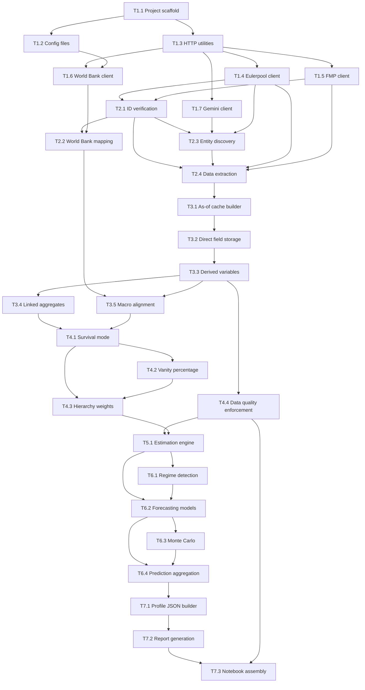

# Operator 1 -- Implementation Plan

Sequenced build plan for the Kaggle-ready Python pipeline described in [`OP1-developer-spec.md`](../OP1-developer-spec.md). Each subtask is a self-contained coding unit that can be implemented, tested, and committed independently.

---

## Dependency Graph



---

## Phase 1: Foundation

### T1.1 -- Project scaffold

**Spec refs:** Sec 1, 19

Create the directory layout and placeholder files. All subsequent tasks import from this structure.

**Files to create:**
```
operator1/
  __init__.py
  constants.py          # date ranges, epsilon, thresholds referenced globally
  secrets_loader.py     # Kaggle secrets client wrapper; fail-fast on missing keys
config/
  world_bank_indicator_map.yml
  country_protection_rules.yml
  survival_hierarchy.yml
  global_config.yml     # timeouts, retries, budgets, FORCE_REBUILD flag
cache/                  # empty dir; .gitkeep
notebooks/
  operator1.ipynb       # skeleton with 20 recommended cells (titles only)
tests/
  __init__.py
requirements.txt        # requests, pandas, numpy, pyarrow, pyyaml, etc.
```

**Acceptance criteria:**
- `import operator1` succeeds with no errors
- `secrets_loader.py` reads `EULERPOOL_API_KEY`, `FMP_API_KEY`, `GEMINI_API_KEY` from Kaggle `UserSecretsClient` with try/except fallback to `os.environ` for local dev
- `constants.py` exports `DATE_START`, `DATE_END` (2-year window from today), `EPSILON`

---

### T1.2 -- Configuration files

**Spec refs:** Sec 4, 12, 14, 20

Populate the three YAML configs with the values described in the spec.

**`config/world_bank_indicator_map.yml`:**
```yaml
inflation_rate_yoy: FP.CPI.TOTL.ZG
cpi_index: FP.CPI.TOTL
unemployment_rate: SL.UEM.TOTL.ZS
gdp_growth: NY.GDP.MKTP.KD.ZG
gdp_current_usd: NY.GDP.MKTP.CD
official_exchange_rate_lcu_per_usd: PA.NUS.FCRF
current_account_balance_pct_gdp: BN.CAB.XOKA.GD.ZS
reserves_months_of_imports: FI.RES.TOTL.MO
# optional proxies
real_interest_rate: FR.INR.RINR
lending_interest_rate: FR.INR.LEND
deposit_interest_rate: FR.INR.DPST
```

**`config/country_protection_rules.yml`:**
- `strategic_sectors` list
- `market_cap_gdp_threshold: 0.001`
- `emergency_rate_cut_threshold: 2.0`
- `emergency_rate_cut_months: 3`

**`config/survival_hierarchy.yml`:**
- Five tiers with weight presets for each regime (normal, company_survival, modified_survival, extreme_survival)
- Vanity-adjusted delta rules

**`config/global_config.yml`:**
- `timeout_s`, `max_retries`, `backoff_factor`, `search_budget_per_group`, `search_budget_global`, `FORCE_REBUILD`

**Acceptance criteria:**
- All YAML files parse without error
- A shared `config_loader.py` module loads any config by name and returns a dict

---

### T1.3 -- HTTP utilities

**Spec refs:** Sec 11, 20

A shared HTTP layer used by all API clients.

**File:** `operator1/http_utils.py`

**Features:**
- `cached_get(url, params, cache_dir, ttl_hours)` -- checks on-disk JSON/Parquet cache before hitting network
- Retry with exponential backoff; respect `Retry-After` header
- Configurable `timeout_s` from global config
- Request logging (URL, status, latency) for `metadata.json`
- API key injection helper: if `?` in URL append `&apikey=`, else `?apikey=`
- Never logs or prints API key values

**Acceptance criteria:**
- Unit test with `unittest.mock.patch` on `requests.get` verifying retry behavior
- Cache hit returns stored response without network call
- Request log list accessible via `get_request_log()`

---

### T1.4 -- Eulerpool API client

**Spec refs:** Sec 3, 5, 6, 8

**File:** `operator1/clients/eulerpool.py`

**Methods:**
- `get_profile(isin)` -> dict with fields from Sec 8
- `get_quotes(identifier)` -> DataFrame (daily: open, high, low, close, volume, etc.)
- `get_income_statement(isin)` -> DataFrame (periodic)
- `get_balance_sheet(isin)` -> DataFrame (periodic)
- `get_cashflow_statement(isin)` -> DataFrame (periodic)
- `get_peers(isin)` -> list of ISINs
- `get_supply_chain(isin)` -> list of dicts
- `get_executives(isin)` -> list of dicts
- `search(query)` -> list of matches (name, ticker, ISIN, exchange, country)

All methods use `http_utils.cached_get`. All parse responses into pandas objects.

**Acceptance criteria:**
- Each method has a type-annotated return
- Error on non-200 status raises `EulerportAPIError` with clear message
- Integration test stub with sample JSON fixtures

---

### T1.5 -- FMP API client

**Spec refs:** Sec 3, 6

**File:** `operator1/clients/fmp.py`

**Methods:**
- `get_quote(symbol)` -> dict (verification)
- `get_daily_ohlcv(symbol, from_date, to_date)` -> DataFrame
- `get_intraday(symbol, interval)` -> DataFrame (optional)

API key appended per the `?`/`&` rule.

**Acceptance criteria:**
- `get_daily_ohlcv` returns DataFrame with columns: date, open, high, low, close, volume
- Fail-fast with `FMPAPIError` on invalid symbol

---

### T1.6 -- World Bank API client

**Spec refs:** Sec 4, 11

**File:** `operator1/clients/world_bank.py`

**Methods:**
- `get_countries()` -> DataFrame (ISO-2 to ISO-3 mapping; cached)
- `iso2_to_iso3(country_iso2)` -> str
- `get_indicator(country_iso3, indicator_code, from_year, to_year)` -> DataFrame (year, value)

Uses retry+backoff from `http_utils`. Respects `Retry-After`.

**Acceptance criteria:**
- Country mapping cached to disk after first call
- Indicator data returned with NaN for missing years

---

### T1.7 -- Gemini client

**Spec refs:** Sec 4, 5, 18

**File:** `operator1/clients/gemini.py`

**Methods:**
- `propose_linked_entities(target_profile, sector_hints)` -> list of dicts per relationship group
- `propose_world_bank_mappings(country, sector)` -> dict (suggestions only, not authoritative)
- `generate_report(company_profile_json)` -> str (markdown)

**Acceptance criteria:**
- All calls wrapped in try/except; return empty/fallback on failure
- Prompt templates stored as constants in the module
- Response parsed robustly (handle malformed JSON from LLM)

---

## Phase 2: Data Ingestion

### T2.1 -- Identifier verification (Step 0 / 0.1)

**Spec refs:** Sec 2, 3

**File:** `operator1/steps/verify_identifiers.py`

**Logic:**
1. Accept `target_isin` and `fmp_symbol` as inputs
2. Call `eulerpool.get_profile(target_isin)` -- fail fast on error
3. Extract `country` (ISO-2) from profile
4. Call `fmp.get_quote(fmp_symbol)` -- fail fast on error
5. Return `VerifiedTarget` dataclass: `isin`, `ticker`, `country`, `sector`, `industry`, `fmp_symbol`, `currency`, `exchange`

**Acceptance criteria:**
- Pipeline halts with clear message if ISIN invalid
- Pipeline halts with clear message if FMP symbol invalid
- Country extracted and available for downstream

---

### T2.2 -- World Bank macro mapping (Step 0.2)

**Spec refs:** Sec 4, 11

**File:** `operator1/steps/macro_mapping.py`

**Logic:**
1. Load `config/world_bank_indicator_map.yml`
2. Convert verified target's country ISO-2 to ISO-3 via `world_bank.iso2_to_iso3()`
3. For each canonical variable, fetch indicator data for 3 years (buffer for as-of alignment)
4. Store raw yearly data as `cache/world_bank_raw/{indicator_code}.parquet`
5. Optionally call `gemini.propose_world_bank_mappings()` and log suggestions (not used at runtime)

**Acceptance criteria:**
- All canonical variables from Sec 11 fetched (or marked missing with reason)
- Disk cache prevents re-fetch on rerun

---

### T2.3 -- Linked entity discovery (Steps A/B)

**Spec refs:** Sec 5

**File:** `operator1/steps/entity_discovery.py`

**Logic:**
1. Call `gemini.propose_linked_entities()` with target profile + sector hints
2. For each proposed entity name, call `eulerpool.search()` to resolve
3. Score matches: ticker exact > name similarity > country match > sector match
4. Accept match only if score >= 70; else drop
5. If zero competitors found, fallback: `eulerpool.get_peers(target_isin)` sorted by market cap, take top 5 (exclude target)
6. Track per-group and global search budgets; checkpoint to `cache/progress.json`
7. Return dict of `{relationship_group: list of LinkedEntity}`

**Acceptance criteria:**
- Each linked entity has: `isin`, `ticker`, `name`, `country`, `sector`, `relationship_group`, `match_score`
- Budget tracking prevents runaway API calls
- Progress checkpoint file written after each batch

---

### T2.4 -- Data extraction (Step C / C.1)

**Spec refs:** Sec 6

**File:** `operator1/steps/data_extraction.py`

**Logic:**
1. For target + each linked entity, fetch: profile, quotes, income statement, balance sheet, cash flow
2. For target only, also fetch: peers, supply chain, executives
3. Fetch FMP daily OHLCV for target (authoritative price source)
4. Store all raw data to `cache/raw/{isin}/` as Parquet files
5. Log every API call in the request log

**Acceptance criteria:**
- All data for target fetched or error logged
- Linked entities fetched in batches with checkpoint
- Raw Parquet files written per entity per data type
- FMP OHLCV has exactly the 2-year date range

---

## Phase 3: Cache and Feature Engineering

### T3.1 -- As-of daily cache builder (Step D)

**Spec refs:** Sec 7, 15

**File:** `operator1/steps/cache_builder.py`

**Logic:**
1. Generate a complete daily date index for the 2-year window (business days)
2. For each entity, build a daily DataFrame by:
   a. Starting with FMP OHLCV (for target) or Eulerpool quotes (for linked)
   b. For each financial statement, apply as-of join: for day `t`, use latest row where `report_date <= t`
   c. Validation: assert no `report_date > t` leaks (fail pipeline if found)
3. Merge profile fields as static columns

**Acceptance criteria:**
- No look-ahead: test with synthetic data where a future report exists and confirm it is rejected
- Every day `t` has the correct latest-as-of statement attached
- Output is a single DataFrame per entity with daily frequency

---

### T3.2 -- Direct field storage

**Spec refs:** Sec 8

**File:** part of `cache_builder.py`

**Logic:**
- Ensure all direct fields from Sec 8 are present as columns:
  - Profile: `isin`, `ticker`, `exchange`, `currency`, `country`, `sector`, `industry`, `sub_industry`
  - Quotes: `open`, `high`, `low`, `close`, `volume`, `adjusted_close`, `vwap`, `market_cap`, `shares_outstanding`
  - Statements: all 21 decision variables listed in Sec 8
- Missing fields stored as `null` with corresponding `is_missing_<field>` flag

**Acceptance criteria:**
- Column schema matches Sec 8 exactly
- `is_missing_*` flags present for every field

---

### T3.3 -- Derived decision variables

**Spec refs:** Sec 9, 15

**File:** `operator1/features/derived_variables.py`

**Logic:**
Compute daily per entity using the safe-ratio helper (Sec 15):
- **Returns/risk:** `return_1d`, `log_return_1d`, `volatility_21d` (rolling std), `drawdown_252d` (rolling max drawdown)
- **Solvency:** `total_debt_asof`, `debt_to_equity_signed`, `debt_to_equity_abs`, `net_debt`, `net_debt_to_ebitda`
- **Liquidity:** `current_ratio`, `quick_ratio`, `cash_ratio`
- **Cash reality:** `free_cash_flow`, `free_cash_flow_ttm_asof` (trailing 4 quarters), `fcf_yield`
- **Profitability:** `gross_margin`, `operating_margin`, `net_margin`, `roe`
- **Valuation (optional):** `pe_ratio_calc`, `earnings_yield_calc`, `ps_ratio_calc`, `enterprise_value`, `ev_to_ebitda`

**Safe ratio helper:** if denominator is null, 0, or abs < EPSILON -> return null, set `is_missing_<var>=1` and `invalid_math_<var>=1`. Handle negative equity: store both signed and absolute D/E.

**Acceptance criteria:**
- All variables from Sec 9 computed
- Safe ratio helper tested with edge cases: zero, null, negative, tiny denominators
- Every derived variable has companion `is_missing_*` flag

---

### T3.4 -- Linked entity aggregates

**Spec refs:** Sec 10

**File:** `operator1/features/linked_aggregates.py`

**Logic:**
- Group linked entities by relationship type: competitors, suppliers, customers, financial_institutions, sector_peers, industry_peers
- For each day and each group, compute: mean, median of key variables (return_21d, volatility_21d, drawdown_252d, etc.)
- Compute relative measures: `rel_strength_vs_sector`, `valuation_premium_vs_industry`
- Output columns like `competitors_avg_return_21d`, `supply_chain_median_vol_21d`

**Acceptance criteria:**
- Aggregates computed for every group with >= 1 member
- Groups with 0 members produce null columns with `is_missing_*` flags
- Persisted to `cache/linked_aggregates_daily.parquet`

---

### T3.5 -- Macro data alignment

**Spec refs:** Sec 11

**File:** `operator1/features/macro_alignment.py`

**Logic:**
1. Load raw World Bank yearly data from T2.2
2. For each canonical variable, align to daily via as-of (latest year <= day's year)
3. Add `is_missing_<var>` flags for days with no data
4. Compute `inflation_rate_daily_equivalent = inflation_rate_yoy / 365`
5. Compute `real_return_1d = return_1d - inflation_rate_daily_equivalent`
6. Merge onto target daily cache

**Acceptance criteria:**
- All 8+ canonical macro variables aligned to daily
- `is_missing_*` flags present
- `real_return_1d` computed correctly

---

## Phase 4: Analysis Logic

### T4.1 -- Survival mode detection (Step F)

**Spec refs:** Sec 12

**File:** `operator1/analysis/survival_mode.py`

**Logic:**

**Company survival flag** (any true triggers):
- `current_ratio < 1.0`
- `debt_to_equity_abs > 3.0`
- `fcf_yield < 0`
- `drawdown_252d < -0.40`

**Country survival flag** (config-driven thresholds from `country_protection_rules.yml`):
- Credit spread > 5%
- Unemployment rose +3% in last 6 months
- Yield curve slope < -0.5%
- FX volatility > 20%

**Country protection flag:**
- Target sector in `strategic_sectors` list, OR
- Market cap > 0.1% of GDP, OR
- Emergency policy-rate cut > 2% in last 3 months

Store `company_survival_mode_flag`, `country_survival_mode_flag`, `country_protected_flag` per day.

**Acceptance criteria:**
- All three flags computed daily
- Thresholds loaded from config (not hardcoded)
- Test with synthetic data hitting each trigger individually

---

### T4.2 -- Vanity percentage

**Spec refs:** Sec 13

**File:** `operator1/analysis/vanity.py`

**Logic:**
Components (each returns spend amount or 0):
1. Executive compensation excess: exec comp > 5% of net income -> excess amount
2. SG&A bloat: company SG&A ratio > 1.2x industry median SG&A ratio -> excess amount
3. Buyback waste: buybacks while `fcf_ttm < 0` -> full buyback amount
4. Marketing excess during survival mode: marketing spend > 10% revenue during survival -> excess

`vanity_percentage = clip(total_vanity_spend / revenue * 100, 0, 100)`

Store per day.

**Acceptance criteria:**
- Each component independently testable
- Vanity % clipped to 0-100 range
- Returns null (not 0) when revenue is null/zero

---

### T4.3 -- Survival hierarchy weights

**Spec refs:** Sec 14

**File:** `operator1/analysis/hierarchy_weights.py`

**Logic:**
1. Load `config/survival_hierarchy.yml`
2. For each day, select regime:
   - Neither flag -> `normal`
   - Company only -> `company_survival`
   - Country only (no protection) -> `modified_survival`
   - Both flags -> `extreme_survival`
3. Look up tier weights from config preset
4. Apply vanity-adjusted deltas if `vanity_percentage > threshold`
5. Store `hierarchy_tier1_weight` ... `hierarchy_tier5_weight` and `survival_regime` label

**Acceptance criteria:**
- All four regimes produce correct weight vectors
- Vanity adjustment modifies weights as configured
- Weights sum to 1.0 (or are normalized)

---

### T4.4 -- Data quality enforcement

**Spec refs:** Sec 15

**File:** `operator1/quality/data_quality.py`

**Logic:**
- **Look-ahead check:** scan all as-of joins for violations; raise `LookAheadError` if any found
- **Ratio safety:** already implemented in T3.3 safe ratio helper; this module runs a full sweep asserting all `invalid_math_*` flags are properly set
- **Missing data audit:** for every derived feature column, verify `is_missing_*` companion exists and is correctly populated
- **Unit normalization:** read units from Eulerpool metadata if available; log unit info in `metadata.json`
- **Summary report:** produce `cache/data_quality_report.json` with coverage percentages per variable

**Acceptance criteria:**
- Pipeline fails if look-ahead violation found
- Quality report generated with coverage stats
- All `is_missing_*` and `invalid_math_*` flags validated

---

## Phase 5: Estimation

### T5.1 -- Post-cache Sudoku inference

**Spec refs:** Sec 16

**File:** `operator1/estimation/estimator.py`

**Logic:**
Input: `full_feature_table` (no extra API calls).

**Pass 1 -- Deterministic identity fill:**
- Accounting identities: `total_assets = total_liabilities + total_equity`, `free_cash_flow = operating_cf - capex`, etc.
- If two of three are observed, fill the third deterministically.

**Pass 2 -- Regime-weighted rolling imputer:**
- For each variable with remaining nulls, train a BayesianRidge (or simpler linear) model using observed values up to day `t` (no look-ahead)
- Weight training samples by survival hierarchy tier weights
- Produce: `x_observed`, `x_estimated`, `x_final`, `x_source` (observed | estimated), `x_confidence` in 0-1 range
- Never overwrite observed values
- Log coverage percentages per variable per tier

**Acceptance criteria:**
- Pass 1 fills all deterministic identities correctly
- Pass 2 never uses future data for training
- Observed values never overwritten
- `x_source` and `x_confidence` columns present for every estimated variable
- Coverage log written to `cache/estimation_coverage.json`

---

## Phase 6: Temporal Modeling

### T6.1 -- Regime detection

**Spec refs:** Sec 17

**File:** `operator1/models/regime_detection.py`

**Logic:**
- HMM on returns + volatility (via `hmmlearn`) -- label states as bull/bear/high_vol/low_vol
- GMM on returns (via sklearn)
- Structural breaks via PELT (`ruptures`) and optional Bayesian change point (`pymc`)
- All wrapped in try/except; set `model_failed_hmm`, `model_failed_gmm`, `model_failed_pelt` flags if any fail
- Output: `regime_label` per day, `structural_break_flag` on break days

**Acceptance criteria:**
- At least one regime detection method succeeds (fallback chain)
- Failed models produce flag but do not crash pipeline
- Regime labels stored in feature table

---

### T6.2 -- Forecasting models

**Spec refs:** Sec 17

**File:** `operator1/models/forecasting.py`

**Logic:**
Each model wrapped in try/except with fallback chain:
- **Kalman filter** for tier 1-2 liquidity/solvency variables (statsmodels)
- **GARCH** for volatility (arch)
- **VAR** for multivariate (statsmodels) -- fallback: AR(1) per variable
- **LSTM** for nonlinear patterns (PyTorch) -- fallback: tree/linear
- **RF/GBM/XGB** for tabular features (sklearn/XGBoost)
- **Baseline** if all fail: last-value or EMA

Forward pass: day-by-day expanding window training; track error per tier.
Burn-out phase: intensive retraining on last ~6 months; early stop if no improvement >= 3 iterations.

**Acceptance criteria:**
- Each model has try/except wrapper and fallback
- `model_failed_<name>` flags set on failure
- Error metrics (MAE, RMSE) logged per model per tier
- At least baseline model always succeeds

---

### T6.3 -- Monte Carlo simulations

**Spec refs:** Sec 17

**File:** `operator1/models/monte_carlo.py`

**Logic:**
- Regime-aware simulations (n ~= 10,000 paths)
- Use fitted model distributions per regime
- Importance sampling for tail events
- Compute survival probability distribution
- Output: `survival_probability_mean`, `survival_probability_p5`, `survival_probability_p95`

**Acceptance criteria:**
- Simulations respect current regime
- Tail probabilities computed via importance sampling
- Results reproducible with fixed random seed

---

### T6.4 -- Prediction aggregation

**Spec refs:** Sec 17

**File:** `operator1/models/prediction_aggregator.py`

**Logic:**
- Ensemble available models (reweight based on which succeeded)
- Produce predictions for: next day, next week, next month, next year
- Include uncertainty bands (confidence intervals)
- Apply Technical Alpha protection: mask next-day OHLC except Low
- Store in `cache/predictions.parquet`

**Acceptance criteria:**
- Multi-horizon predictions with uncertainty
- Technical Alpha masking applied
- Ensemble weights reflect model availability

---

## Phase 7: Report and Notebook Assembly

### T7.1 -- Profile JSON builder

**Spec refs:** Sec 18

**File:** `operator1/report/profile_builder.py`

**Logic:**
Build `company_profile.json` aggregating:
- Target identity and verified info
- Survival flags (company, country, protection)
- Linked entity aggregates summary
- Temporal results (regimes, predictions, model metrics)
- Vanity percentage summary
- Monte Carlo survival probabilities
- Data quality summary (coverage, failed modules)
- Estimation coverage stats

**Acceptance criteria:**
- JSON is valid and comprehensive
- Includes all sections needed for report generation
- Failed modules listed with mitigations applied

---

### T7.2 -- Report generation

**Spec refs:** Sec 18

**File:** `operator1/report/report_generator.py`

**Logic:**
1. Pass `company_profile.json` to `gemini.generate_report()`
2. Output: Bloomberg-style markdown report
3. Required **LIMITATIONS** section covering: data window, OHLCV source caveats, macro frequency, missingness summary, failed modules and mitigations
4. Optional charts (matplotlib/plotly):
   - Price history with regime shading
   - Forecast candlesticks with uncertainty bands
   - Hierarchy weight evolution
   - Survival timeline
   - Monte Carlo distribution
5. Optional PDF via pandoc

**Acceptance criteria:**
- Report generated in markdown format
- LIMITATIONS section present and accurate
- Charts render without error (or are skipped gracefully)

---

### T7.3 -- Notebook assembly

**Spec refs:** Sec 19, 20

**File:** `notebooks/operator1.ipynb`

Assemble the 20-cell Kaggle notebook importing from all modules:

| Cell | Content | Module |
|------|---------|--------|
| 1 | Intro / guarantees | markdown |
| 2 | Inputs: target_isin, fmp_symbol | constants |
| 3 | Load secrets | secrets_loader |
| 4 | Global config | config_loader |
| 5 | HTTP utilities | http_utils |
| 6 | Eulerpool client | clients/eulerpool |
| 7 | FMP client | clients/fmp |
| 8 | ID verification + country extraction | steps/verify_identifiers |
| 9 | World Bank macro module | steps/macro_mapping + clients/world_bank |
| 10 | Linked entity discovery | steps/entity_discovery + clients/gemini |
| 11 | Linked resolution + checkpointing | steps/entity_discovery |
| 12 | Target OHLCV build | clients/fmp |
| 13 | Target fundamentals as-of table | steps/cache_builder |
| 14 | Feature engineering + safety flags | features/* + quality/* |
| 15 | Linked caches in batches | steps/cache_builder |
| 16 | Linked aggregates join | features/linked_aggregates |
| 17 | Survival mode + hierarchy + vanity | analysis/* |
| 18 | Save cache artifacts | cache_builder (persist) |
| 19 | Modeling/prediction cells | models/* (one try/except per model) |
| 20 | Report generation + LIMITATIONS | report/* |

**Operational guardrails (Sec 20):**
- Every cell checks "load if cached unless `FORCE_REBUILD=True`"
- Disk cache for HTTP responses
- Secrets never printed
- Short-circuit on critical verification failures

**Acceptance criteria:**
- Notebook runs top-to-bottom on Kaggle (with valid API keys)
- Each cell is idempotent
- Failed optional cells (modeling) do not block subsequent cells
- All cache artifacts written to `cache/` directory

---

## Recommended Implementation Order

The phases are designed to be implemented sequentially. Within each phase, subtasks should be done in the numbered order due to dependencies. Here is the recommended sequence grouped into work batches:

**Batch A (Foundation):** T1.1 -> T1.2 -> T1.3 -> T1.4, T1.5, T1.6, T1.7 (clients can be parallel)

**Batch B (Ingestion):** T2.1 -> T2.2, T2.3 (can be parallel) -> T2.4

**Batch C (Features):** T3.1 -> T3.2 -> T3.3 -> T3.4, T3.5 (can be parallel)

**Batch D (Analysis):** T4.4 (quality first) -> T4.1 -> T4.2 -> T4.3

**Batch E (Estimation):** T5.1

**Batch F (Modeling):** T6.1, T6.2 (can start in parallel) -> T6.3 -> T6.4

**Batch G (Report):** T7.1 -> T7.2 -> T7.3
