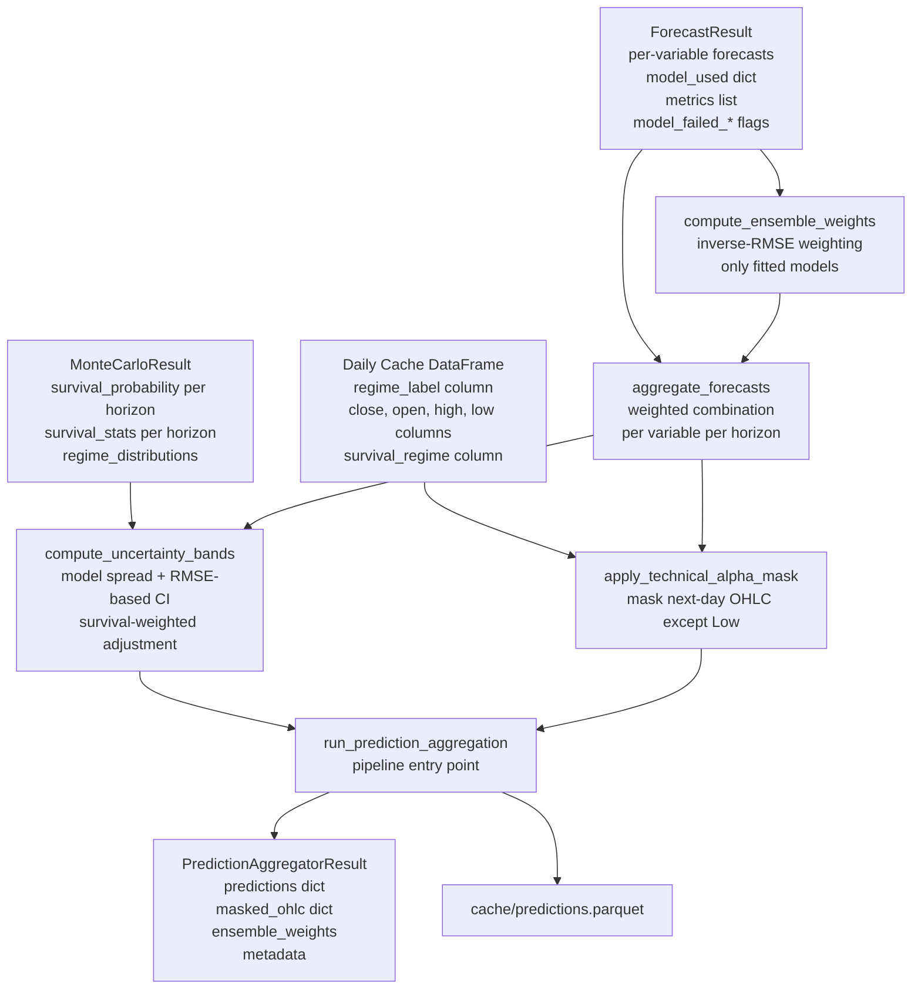

# T6.4 -- Prediction Aggregation Module Design

## Overview

The prediction aggregator is the final module in Phase 6 (Temporal Modeling). It consumes outputs from T6.1 (regime detection), T6.2 (forecasting models), and T6.3 (Monte Carlo simulations) to produce unified, multi-horizon predictions with uncertainty bands and Technical Alpha protection.

**File:** `operator1/models/prediction_aggregator.py`
**Tests:** `tests/test_phase6_prediction_aggregator.py`
**Spec refs:** Sec 17

---

## Data Flow



---

## Data Structures

### Input Contracts

From `forecasting.py`:
- `ForecastResult.forecasts`: `dict[str, dict[str, float]]` -- `{variable: {horizon_label: value}}`
- `ForecastResult.model_used`: `dict[str, str]` -- `{variable: model_name}`
- `ForecastResult.metrics`: `list[ModelMetrics]` -- each has `model_name`, `variable`, `mae`, `rmse`, `fitted`
- `ForecastResult.model_failed_*`: bools for kalman, garch, var, lstm, tree

From `monte_carlo.py`:
- `MonteCarloResult.survival_probability`: `dict[str, float]` -- `{horizon_label: prob}`
- `MonteCarloResult.survival_stats`: `dict[str, dict[str, float]]` -- `{horizon_label: {mean, std, p5, p25, median, p75, p95}}`
- `MonteCarloResult.survival_probability_mean/p5/p95`: floats

From the daily cache DataFrame:
- `close`, `open`, `high`, `low` columns for Technical Alpha
- `regime_label` column

### Output Data Structures

```python
@dataclass
class HorizonPrediction:
    """Single prediction for one variable at one horizon."""
    variable: str = ""
    horizon: str = ""              # "1d", "5d", "21d", "252d"
    point_forecast: float = float("nan")
    lower_ci: float = float("nan")  # 5th percentile
    upper_ci: float = float("nan")  # 95th percentile
    confidence: float = float("nan") # 0-1 overall confidence score
    model_used: str = ""            # which model produced the forecast
    ensemble_weight: float = 0.0    # weight this model got in ensemble
    survival_adjusted: bool = False # whether survival prob was factored in


@dataclass
class TechnicalAlphaMask:
    """Masked OHLC predictions for Technical Alpha protection."""
    next_day_open: float | None = None   # MASKED (set to None)
    next_day_high: float | None = None   # MASKED (set to None)
    next_day_low: float = float("nan")   # VISIBLE (the only unmasked value)
    next_day_close: float | None = None  # MASKED (set to None)
    mask_applied: bool = True


@dataclass
class PredictionAggregatorResult:
    """Container for all prediction aggregation outputs."""
    
    # Per-variable, per-horizon predictions.
    # {variable: {horizon: HorizonPrediction}}
    predictions: dict[str, dict[str, HorizonPrediction]]
    
    # Technical Alpha masked OHLC.
    technical_alpha: TechnicalAlphaMask
    
    # Ensemble weights per model type.
    # {model_name: weight}
    ensemble_weights: dict[str, float]
    
    # Number of models that contributed.
    n_models_available: int = 0
    n_models_failed: int = 0
    
    # Survival probability summary (pass-through from MC).
    survival_probability_mean: float = float("nan")
    survival_probability_p5: float = float("nan")
    survival_probability_p95: float = float("nan")
    
    # Current regime at prediction time.
    current_regime: str = ""
    
    # Metadata.
    prediction_date: str = ""  # ISO date string
    variables_predicted: list[str]
    horizons: list[str]  # ["1d", "5d", "21d", "252d"]
    
    # Error info.
    error: str | None = None
    fitted: bool = False
```

---

## Core Logic

### 1. Ensemble Weight Computation (`compute_ensemble_weights`)

**Strategy: Inverse-RMSE weighting**

For each variable, multiple models may have been attempted. The `ForecastResult.metrics` list contains per-model, per-variable RMSE. The ensemble weight for model `m` on variable `v` is:

```
w_m = (1 / RMSE_m) / sum(1 / RMSE_j for all fitted models j)
```

**Edge cases:**
- If only one model fitted for a variable, it gets weight 1.0
- If a model's RMSE is NaN or 0, skip it (use uniform weights among remaining)
- If no model has a valid RMSE, use uniform weights across fitted models
- The `model_failed_*` flags determine which model types are excluded globally

**Output:** `dict[str, float]` mapping model_name -> weight (normalized to sum to 1.0)

### 2. Forecast Aggregation (`aggregate_forecasts`)

For each variable and horizon:
1. Collect all per-model forecasts from `ForecastResult.forecasts`
2. Since `ForecastResult` only stores the *winning* model's forecast per variable (from `run_forecasting`), the aggregation simplifies to: use the forecast from the best model as the point estimate
3. If we had multiple model forecasts per variable (future extension), we'd do weighted average: `prediction = sum(w_m * f_m) for m in models`

In practice, `ForecastResult.forecasts[variable][horizon]` already contains the best model's forecast. The aggregator's main value-add is combining this with uncertainty and survival information.

### 3. Uncertainty Band Computation (`compute_uncertainty_bands`)

Two sources of uncertainty are combined:

**A. Model-based uncertainty (from RMSE):**
```
lower_ci = point_forecast - z_score * rmse_of_best_model * sqrt(horizon_days)
upper_ci = point_forecast + z_score * rmse_of_best_model * sqrt(horizon_days)
```
Where `z_score = 1.645` for 90% CI (p5 to p95). The `sqrt(horizon_days)` scales the uncertainty by the square root of time (standard financial assumption for independent errors).

**B. Survival-weighted adjustment:**
If `MonteCarloResult` is available, the uncertainty bands are widened proportionally to survival risk:
```
survival_prob = mc_result.survival_probability[horizon]
risk_factor = 1.0 + (1.0 - survival_prob) * SURVIVAL_RISK_MULTIPLIER
adjusted_lower = point_forecast - (point_forecast - lower_ci) * risk_factor
adjusted_upper = point_forecast + (upper_ci - point_forecast) * risk_factor
```
Where `SURVIVAL_RISK_MULTIPLIER = 2.0` (configurable). This widens bands when survival probability is low.

**C. Confidence score:**
```
confidence = survival_prob * model_quality_score
```
Where `model_quality_score` is derived from the model's normalized RMSE (lower RMSE = higher score, scaled 0-1).

### 4. Technical Alpha Masking (`apply_technical_alpha_mask`)

Per the spec: "apply Technical Alpha protection by masking next-day OHLC except Low."

- Extract the latest `close` from the cache as the baseline for next-day OHLC estimation
- If the forecasting models produced a next-day forecast for `close` or price-related variables, that's used as a proxy for next-day OHLC
- **Mask** (set to `None`): `next_day_open`, `next_day_high`, `next_day_close`
- **Reveal** (keep value): `next_day_low` -- estimated from the point forecast minus a volatility-based buffer

The `next_day_low` estimate:
```
last_close = cache["close"].iloc[-1]
if "volatility_21d" in forecasted variables:
    vol = latest volatility estimate
else:
    vol = cache["volatility_21d"].iloc[-1] (or 0.02 default)

next_day_low = last_close * (1 - vol * INTRADAY_LOW_FACTOR)
```
Where `INTRADAY_LOW_FACTOR = 1.5` (typical intraday low sits ~1.5x daily vol below open).

### 5. Persistence (`save_predictions`)

Flatten `PredictionAggregatorResult.predictions` into a DataFrame:
- Columns: `variable`, `horizon`, `point_forecast`, `lower_ci`, `upper_ci`, `confidence`, `model_used`, `ensemble_weight`, `survival_adjusted`
- Save to `cache/predictions.parquet`

Also save a summary JSON `cache/prediction_summary.json` with:
- `technical_alpha` mask info
- `ensemble_weights`
- `survival_probability` summary
- `current_regime`
- `prediction_date`
- Model availability summary

### 6. Pipeline Entry Point (`run_prediction_aggregation`)

```python
def run_prediction_aggregation(
    cache: pd.DataFrame,
    forecast_result: ForecastResult,
    mc_result: MonteCarloResult | None = None,
    *,
    confidence_level: float = 0.90,
    survival_risk_multiplier: float = 2.0,
    save_to_cache: bool = True,
) -> PredictionAggregatorResult:
```

**Steps:**
1. Compute ensemble weights from `forecast_result.metrics`
2. Aggregate forecasts per variable per horizon
3. Compute uncertainty bands (RMSE-based + survival-adjusted)
4. Apply Technical Alpha mask
5. Build `PredictionAggregatorResult`
6. If `save_to_cache`, write `cache/predictions.parquet` and `cache/prediction_summary.json`
7. Log summary

---

## Constants

```python
# Horizons (matching forecasting.py).
HORIZONS: dict[str, int] = {"1d": 1, "5d": 5, "21d": 21, "252d": 252}

# CI z-score for 90% interval (5th to 95th percentile).
Z_SCORE_90: float = 1.645

# Default confidence level.
DEFAULT_CONFIDENCE_LEVEL: float = 0.90

# Survival risk multiplier: how much to widen bands when survival is low.
DEFAULT_SURVIVAL_RISK_MULTIPLIER: float = 2.0

# Intraday low estimation factor (multiples of daily vol).
INTRADAY_LOW_FACTOR: float = 1.5

# Minimum RMSE to avoid division by zero in inverse weighting.
MIN_RMSE_FOR_WEIGHTING: float = 1e-10
```

---

## Test Plan

### Unit Tests

| Test Class | Tests | What It Validates |
|---|---|---|
| `TestComputeEnsembleWeights` | single model gets weight 1.0; inverse-RMSE ordering; NaN RMSE handled; all NaN uses uniform; empty metrics returns empty | Weight computation correctness |
| `TestAggregateForecast` | single variable single model; missing variable handled; all horizons present; empty ForecastResult | Aggregation logic |
| `TestComputeUncertaintyBands` | wider bands at longer horizons; survival adjustment widens bands; no MC result still works; zero RMSE handled | CI computation |
| `TestConfidenceScore` | high survival + low RMSE = high confidence; low survival = low confidence; NaN handling | Confidence scoring |
| `TestTechnicalAlphaMask` | open/high/close are None; low is a float; low is below last close; no close column graceful | TA masking |
| `TestTechnicalAlphaMaskDefault` | default mask when cache has no price columns | Edge case handling |
| `TestHorizonPrediction` | default state; all fields populated | Dataclass |
| `TestPredictionAggregatorResult` | default state; fitted flag | Dataclass |

### Integration Tests

| Test Class | Tests | What It Validates |
|---|---|---|
| `TestRunPredictionAggregation` | returns result; predictions populated; all horizons present; TA mask applied; ensemble weights sum to 1; saves parquet if enabled | Full pipeline |
| `TestWithMonteCarlo` | survival probs passed through; bands widened; confidence reflects survival | MC integration |
| `TestWithoutMonteCarlo` | works with mc_result=None; bands still computed; confidence based on model quality only | Graceful degradation |
| `TestFullPhase6Pipeline` | T6.1 -> T6.2 -> T6.3 -> T6.4 sequence; all results compatible; no crashes | End-to-end |
| `TestPersistence` | parquet file written; summary JSON written; parquet has correct schema; can round-trip read | File I/O |
| `TestEdgeCases` | empty ForecastResult; single variable; all models failed (baseline only); no regime labels | Robustness |

---

## File-by-File Changes

### 1. `operator1/models/prediction_aggregator.py` (NEW)

Complete module implementing all the logic above. Approximately 400-500 lines following the same patterns as `forecasting.py` and `monte_carlo.py`:
- Module docstring
- Imports (numpy, pandas, logging, dataclasses, typing, pathlib)
- Import from `operator1.models.forecasting` (ForecastResult, ModelMetrics, HORIZONS)
- Import from `operator1.models.monte_carlo` (MonteCarloResult)
- Import from `operator1.constants` (CACHE_DIR)
- Constants section
- Dataclass definitions (HorizonPrediction, TechnicalAlphaMask, PredictionAggregatorResult)
- Helper functions (compute_ensemble_weights, aggregate_forecasts, compute_uncertainty_bands, compute_confidence_score, apply_technical_alpha_mask, save_predictions)
- Pipeline entry point (run_prediction_aggregation)

### 2. `tests/test_phase6_prediction_aggregator.py` (NEW)

Test suite following the same patterns as existing phase 6 test files. Uses synthetic data helpers consistent with `test_phase6_forecasting.py` and `test_phase6_monte_carlo.py`.

### 3. `operator1/models/__init__.py` (UPDATE)

Add T6.4 reference to the docstring:
```
T6.4: prediction_aggregator -- ensemble weighting, multi-horizon predictions,
                               uncertainty bands, Technical Alpha masking
```
