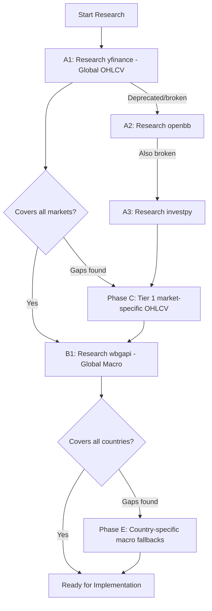

# Community Wrapper Research Plan: OHLCV and Macro Data

## Context

After removing all government APIs, Alpha Vantage, and macro APIs, the codebase needs **free community unofficial wrapper libraries** for two data categories:

1. **OHLCV Price Data** -- daily Open/High/Low/Close/Volume for all supported markets
2. **Macro Economic Data** -- GDP, inflation, interest rates, unemployment, currency for survival mode analysis

Each wrapper must be researched following the **Research-Driven Engineering Protocol** before any implementation.

---

## Current State

### What We Have (PIT wrappers -- kept)
| Market | Wrapper | Library | Data Provided |
|--------|---------|---------|---------------|
| US | us_edgar.py | edgartools + sec-edgar-api | Financials, profile |
| UK | uk_ch_wrapper.py | direct HTTP with caching | Financials, profile |
| EU | eu_esef_wrapper.py | pyesef | Financials |
| Japan | jp_edinet_wrapper.py | edinet-tools | Financials |
| Korea | kr_dart_wrapper.py | dart-fss | Financials |
| Taiwan | tw_mops_wrapper.py | scraper | Financials |
| Brazil | br_cvm_wrapper.py | pycvm | Financials |
| Chile | cl_cmf_wrapper.py | direct HTTP with caching | Financials |

### What We Need (gaps after API removal)
- **OHLCV**: None of the PIT wrappers provide price data. Alpha Vantage was removed.
- **Macro**: All 10 government macro APIs were removed. No macro data source exists.

---

## Research Sequence: Tier Priority Order

### Phase A: Global OHLCV Provider (covers ALL markets)

Research one global OHLCV library first -- if it covers all markets, we avoid per-market research.

```
Research Queue Order:
  A1. yfinance (Yahoo Finance wrapper -- global coverage)
  A2. openbb (OpenBB Platform -- multi-source aggregator)
  A3. investpy (Investing.com wrapper -- global coverage)
  A4. exchange-specific fallbacks (per-market, only if global fails)
```

#### A1: yfinance -- PRIMARY CANDIDATE
- **PyPI**: yfinance
- **GitHub**: ranaroussi/yfinance
- **Coverage**: Global -- US, UK, EU, Japan, Korea, Taiwan, Brazil, Chile, + Tier 2 markets
- **Data**: OHLCV, dividends, splits, financials
- **Free**: Yes, no API key
- **Research search queries**:
  - "yfinance official documentation 2026"
  - "yfinance latest stable version PyPI"
  - "yfinance breaking changes 2025-2026"
  - "yfinance rate limiting best practices"
- **Output**: `.roo/research/ohlcv-yfinance-YYYY-MM-DD.md`

#### A2: openbb -- FALLBACK/COMPLEMENT
- **PyPI**: openbb
- **GitHub**: OpenBB-finance/OpenBB
- **Coverage**: Multi-source aggregator
- **Research search queries**:
  - "openbb platform documentation 2026"
  - "openbb free data providers"
  - "openbb breaking changes 2025-2026"
- **Output**: `.roo/research/ohlcv-openbb-YYYY-MM-DD.md`

#### A3: investpy -- LEGACY FALLBACK
- **PyPI**: investpy
- **GitHub**: alvarobartt/investpy
- **Note**: May be archived/unmaintained -- verify status
- **Output**: `.roo/research/ohlcv-investpy-YYYY-MM-DD.md`

---

### Phase B: Global Macro Provider (covers ALL countries)

Research one global macro library first -- if it covers all countries, we avoid per-country research.

```
Research Queue Order:
  B1. wbgapi (World Bank -- 200+ countries, free, no key)
  B2. pandas-datareader (multi-source: FRED, World Bank, OECD)
  B3. fredapi + fallbacks (US primary, with country mapping)
  B4. openbb macro module
  B5. Per-country community wrappers (only if global fails)
```

#### B1: wbgapi -- PRIMARY CANDIDATE
- **PyPI**: wbgapi
- **GitHub**: tgherzog/wbgapi
- **Coverage**: 200+ countries -- GDP, inflation, interest rates, unemployment
- **Free**: Yes, no API key
- **Indicators needed**:
  - GDP: `NY.GDP.MKTP.CD`
  - Inflation: `FP.CPI.TOTL.ZG`
  - Interest rate: `FR.INR.RINR`
  - Unemployment: `SL.UEM.TOTL.ZS`
  - Exchange rate: `PA.NUS.FCRF`
- **Research search queries**:
  - "wbgapi Python documentation 2026"
  - "wbgapi latest version PyPI"
  - "World Bank API Python wrapper"
  - "wbgapi breaking changes"
- **Output**: `.roo/research/macro-wbgapi-YYYY-MM-DD.md`

#### B2: pandas-datareader -- COMPLEMENT
- **PyPI**: pandas-datareader
- **Coverage**: FRED, World Bank, OECD, Eurostat, Stooq
- **Free**: Yes (FRED needs free key)
- **Research search queries**:
  - "pandas-datareader documentation 2026"
  - "pandas-datareader data sources available"
  - "pandas-datareader breaking changes 2025-2026"
- **Output**: `.roo/research/macro-pandas-datareader-YYYY-MM-DD.md`

#### B3: fredapi -- US COMPLEMENT
- **PyPI**: fredapi
- **Note**: Already in requirements.txt (commented out). FRED is free with key.
- **Consideration**: FRED is a government API but fredapi is an unofficial wrapper. User decision needed on whether to include.
- **Output**: `.roo/research/macro-fredapi-YYYY-MM-DD.md`

#### B4: openbb macro module
- **Coverage**: Multi-source macro aggregator
- **Output**: `.roo/research/macro-openbb-YYYY-MM-DD.md`

---

### Phase C: Tier 1 Market-Specific OHLCV Fallbacks

Only needed if Phase A global providers do not cover a specific Tier 1 market.

```
Research Queue Order (by market cap, descending):
  C1. US ($50T)     -- likely covered by yfinance
  C2. EU ($8-9T)    -- likely covered by yfinance
  C3. Japan ($6.5T) -- jpx-downloader or similar
  C4. UK ($3.18T)   -- likely covered by yfinance
  C5. Korea ($2.5T) -- pykrx (Korean exchange wrapper)
  C6. Brazil ($2.2T) -- likely covered by yfinance
  C7. Taiwan (~$1.2T) -- twstock (TWSE wrapper)
  C8. Chile ($0.4T)  -- likely covered by yfinance
```

#### C5: pykrx -- Korea-specific OHLCV
- **PyPI**: pykrx
- **GitHub**: sharebook-kr/pykrx
- **Coverage**: KOSPI/KOSDAQ daily OHLCV
- **Free**: Yes, no key
- **Output**: `.roo/research/ohlcv-pykrx-YYYY-MM-DD.md`

#### C7: twstock -- Taiwan-specific OHLCV
- **PyPI**: twstock
- **GitHub**: mlouielu/twstock
- **Coverage**: TWSE daily OHLCV
- **Free**: Yes, no key
- **Output**: `.roo/research/ohlcv-twstock-YYYY-MM-DD.md`

---

### Phase D: Tier 2 Market-Specific OHLCV Fallbacks

Only needed if Phase A global providers do not cover a specific Tier 2 market.

```
Research Queue Order (by market cap, descending):
  D1. China ($10T)       -- akshare or baostock
  D2. Hong Kong ($4.5T)  -- likely covered by yfinance
  D3. India ($4T)        -- jugaad-data or nsetools
  D4. Canada ($3T)       -- likely covered by yfinance
  D5. Saudi Arabia ($2.7T) -- research needed
  D6. Australia ($1.8T)  -- likely covered by yfinance
  D7. Switzerland ($1.8T) -- likely covered by yfinance
  D8. South Africa ($1T) -- likely covered by yfinance
  D9. Sweden ($0.9T)     -- likely covered by yfinance
  D10. UAE ($0.8T)       -- research needed
  D11. Italy ($0.8T)     -- likely covered by yfinance
  D12. Spain ($0.7T)     -- likely covered by yfinance
  D13. Singapore ($0.6T) -- likely covered by yfinance
  D14. Mexico ($0.5T)    -- likely covered by yfinance
  D15. Netherlands ($1.2T) -- likely covered by yfinance
```

#### D1: akshare -- China-specific
- **PyPI**: akshare
- **GitHub**: akfamily/akshare
- **Coverage**: SSE/SZSE stocks, macro, funds
- **Output**: `.roo/research/ohlcv-akshare-YYYY-MM-DD.md`

#### D3: jugaad-data -- India-specific
- **PyPI**: jugaad-data
- **GitHub**: jugaad-py/jugaad-data
- **Coverage**: NSE/BSE stocks, RBI rates
- **Output**: `.roo/research/ohlcv-jugaad-data-YYYY-MM-DD.md`

---

### Phase E: Per-Country Macro Fallbacks

Only needed if Phase B global providers do not cover a specific country's macro indicators.

```
Research Queue Order (Tier 1 first, then Tier 2):
  E1. US -- pandas-datareader FRED source
  E2. EU/UK/DE/FR -- pandas-datareader Eurostat/OECD sources
  E3. Japan -- japandas or estatapi
  E4. Korea -- research needed
  E5. Taiwan -- research needed
  E6. Brazil -- python-bcb (Banco Central wrapper)
  E7. Chile -- research needed
  E8-E15. Tier 2 countries -- World Bank fallback
```

#### E6: python-bcb -- Brazil macro
- **PyPI**: python-bcb
- **GitHub**: wilsonfreitas/python-bcb
- **Coverage**: BCB SELIC, IPCA, GDP, FX
- **Output**: `.roo/research/macro-python-bcb-YYYY-MM-DD.md`

---

## Execution Flow Diagram



## Research Protocol Per Library

For each library in the sequence, execute:

1. **PyPI version check**: `web_fetch https://pypi.org/pypi/PACKAGE/json`
2. **Documentation search**: Search for official docs, latest version, breaking changes
3. **GitHub repo check**: Stars, last commit, open issues, maintenance status
4. **Coverage verification**: Does it cover the specific markets/indicators needed?
5. **Create research log**: `.roo/research/CATEGORY-LIBRARY-YYYY-MM-DD.md`
6. **Present findings**: Summary with recommendation
7. **Wait for user confirmation** before next research item

## Decision Criteria

A wrapper is acceptable if it meets ALL of these:
- Free (no API key required, or free registration only)
- Unofficial/community (not a direct government API)
- Actively maintained (commits in last 12 months)
- Covers the needed data (OHLCV or macro indicators)
- Python package available on PyPI
- No restrictive license that prevents commercial use

## Priority Summary

| Priority | Phase | Library | Data Type | Markets Covered |
|----------|-------|---------|-----------|-----------------|
| 1 | A1 | yfinance | OHLCV | All markets globally |
| 2 | B1 | wbgapi | Macro | All countries globally |
| 3 | B2 | pandas-datareader | Macro | FRED, OECD, Eurostat |
| 4 | C5 | pykrx | OHLCV | Korea only |
| 5 | C7 | twstock | OHLCV | Taiwan only |
| 6 | D1 | akshare | OHLCV+Macro | China only |
| 7 | D3 | jugaad-data | OHLCV | India only |
| 8 | E6 | python-bcb | Macro | Brazil only |
| 9 | A2 | openbb | OHLCV+Macro | Multi-source fallback |

---

## Next Steps

After research is complete for each library:
1. Update `requirements.txt` with selected packages
2. Create new `ohlcv_provider.py` using the chosen wrapper
3. Create new `macro_client.py` using the chosen wrapper
4. Wire into `main.py`, `data_extraction.py`, `macro_mapping.py`
5. Update `pit_registry.py` MACRO_APIS entries
6. Run tests and create PR
