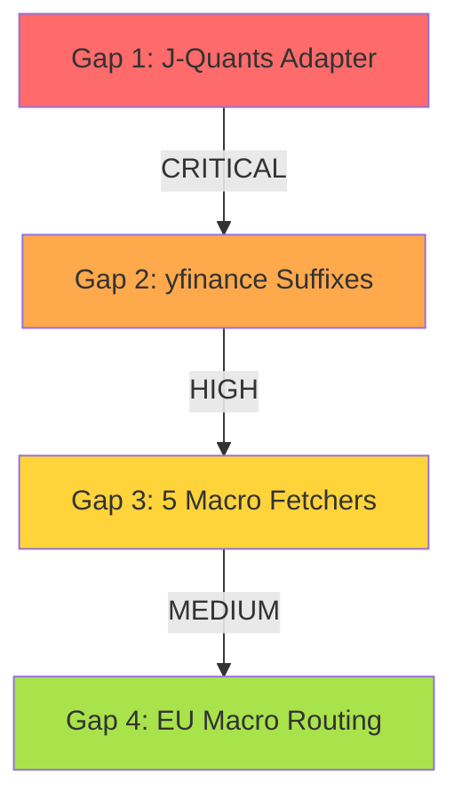

# Fix Coverage Gaps Without Changing Wrappers

All fixes follow the same principle: the wrappers are correct as-is from their sources. We add adapter/bridge code in OUR modules to handle each wrapper's unique structure.

## Gap 1 (CRITICAL): J-Quants Missing PITClient Protocol Methods

**Problem**: `jp_jquants_wrapper.py` has `get_financials()` returning a dict of 3 DataFrames, but `data_extraction.py` calls individual methods like `get_income_statement()`, `get_balance_sheet()`, `get_cashflow_statement()`, `get_quotes()`, `search_company()`.

**Fix location**: `operator1/clients/equity_provider.py` -- the factory function `create_pit_client()`

**Approach**: Wrap the J-Quants client in an adapter class inside `equity_provider.py` that implements the PITClient protocol by delegating to the wrapper's existing methods:

```python
class _JPJquantsAdapter:
    """Adapter that maps PITClient protocol to JPJquantsClient's API.
    
    JPJquantsClient returns all financials via get_financials() as a dict.
    This adapter exposes them as individual get_income_statement() etc.
    methods so data_extraction.py can consume them uniformly.
    """
    def __init__(self, client):
        self._client = client
        self._financials_cache = {}
    
    @property
    def market_id(self): return self._client.market_id
    
    @property 
    def market_name(self): return self._client.market_name
    
    def list_companies(self, query=""): return self._client.list_companies(query)
    def search_company(self, name): return self._client.list_companies(query=name)
    def get_profile(self, identifier): return self._client.get_profile(identifier)
    def get_peers(self, identifier): return self._client.get_peers(identifier)
    def get_executives(self, identifier): return self._client.get_executives(identifier)
    
    def _get_financials(self, identifier):
        if identifier not in self._financials_cache:
            self._financials_cache[identifier] = self._client.get_financials(identifier)
        return self._financials_cache[identifier]
    
    def get_income_statement(self, identifier):
        return self._get_financials(identifier).get("income", pd.DataFrame())
    
    def get_balance_sheet(self, identifier):
        return self._get_financials(identifier).get("balance", pd.DataFrame())
    
    def get_cashflow_statement(self, identifier):
        return self._get_financials(identifier).get("cashflow", pd.DataFrame())
    
    def get_quotes(self, identifier):
        # J-Quants provides OHLCV via get_daily_bars -- delegate
        # Falls back to OHLCV provider (yfinance .T suffix)
        return pd.DataFrame()
```

Then in `create_pit_client()`:
```python
if market_id == "jp_jquants":
    from operator1.clients.jp_jquants_wrapper import JPJquantsClient
    raw_client = JPJquantsClient(api_key=api_key)
    return _JPJquantsAdapter(raw_client)
```

**Key point**: The J-Quants wrapper is NOT changed. The adapter sits in our code.

## Gap 2 (HIGH): Missing yfinance Suffixes for NL, ES, IT, SE

**Problem**: `ohlcv_yfinance.py`'s `_MARKET_SUFFIX` dict is missing entries for `nl_esef`, `es_esef`, `it_esef`, `se_esef`.

**Fix location**: `operator1/clients/ohlcv_yfinance.py` -- add 4 entries to `_MARKET_SUFFIX`

This is NOT changing the yfinance wrapper's API -- it's just adding configuration data for our market registry. yfinance itself is unchanged.

```python
_MARKET_SUFFIX = {
    ...existing entries...
    "nl_esef": ".AS",   # Euronext Amsterdam
    "es_esef": ".MC",   # BME Madrid
    "it_esef": ".MI",   # Borsa Italiana Milan
    "se_esef": ".ST",   # Nasdaq Stockholm
}
```

## Gap 3 (MEDIUM): 5 Macro APIs Registered But Not Wired

**Problem**: `pit_registry.py` defines `MACRO_APIS` entries for UK (ONS), Japan (e-Stat), Korea (KOSIS), Taiwan (DGBAS), Chile (BCCh) but `macro_provider.py` doesn't have fetchers for them. They all fall through to wbgapi (annual-only World Bank data).

**Fix location**: `operator1/clients/macro_provider.py` -- add country codes to `_PRIMARY_FETCHERS` and create thin fetcher modules

**Approach**: For each missing macro source, create a fetcher module that uses the free government API. The macro_provider dispatcher routes to them:

```python
_PRIMARY_FETCHERS = {
    "US": "fred",
    "EU": "ecb", "DE": "ecb", "FR": "ecb",
    "BR": "bcb",
    "MX": "banxico",
    # NEW: wire the 5 registered-but-unimplemented sources
    "GB": "ons",      # macro_ons.py
    "JP": "estat",    # macro_estat.py  
    "KR": "kosis",    # macro_kosis.py
    "TW": "dgbas",    # macro_dgbas.py
    "CL": "bcch",     # macro_bcch.py
}
```

Each new macro fetcher follows the same pattern as `macro_fredapi.py` / `macro_bcb.py`:
- Import the library or use direct HTTP
- Fetch GDP, inflation, interest rate, unemployment, FX rate
- Return `dict[str, pd.Series]` with canonical indicator names

**Order of implementation** (by market cap coverage):
1. `macro_ons.py` for UK ($3.18T) -- ONS API is public, no key needed
2. `macro_estat.py` for Japan ($6.5T) -- e-Stat API, free registration
3. `macro_kosis.py` for Korea ($2.5T) -- KOSIS API, free registration
4. `macro_dgbas.py` for Taiwan ($1.2T) -- DGBAS, no key
5. `macro_bcch.py` for Chile ($0.4T) -- BCCh API, free registration

## Gap 4 (LOW): Tier 2 Markets With Only wbgapi Macro

14 markets rely solely on wbgapi for macro data. This provides annual GDP, inflation, unemployment -- sufficient for survival analysis but not for high-frequency regime detection.

**No immediate fix needed** -- wbgapi is an acceptable fallback. The EU-based markets (NL, ES, IT, SE) should route through the ECB fetcher since they're eurozone.

**Fix for EU markets**: In `macro_provider.py`, add country code -> ECB routing:

```python
_PRIMARY_FETCHERS = {
    ...existing...
    "NL": "ecb",
    "ES": "ecb", 
    "IT": "ecb",
    # SE is NOT eurozone -- stays on wbgapi
}
```

## Implementation Order



All fixes are in our adapter/bridge/config code. Zero changes to wrapper source files.
