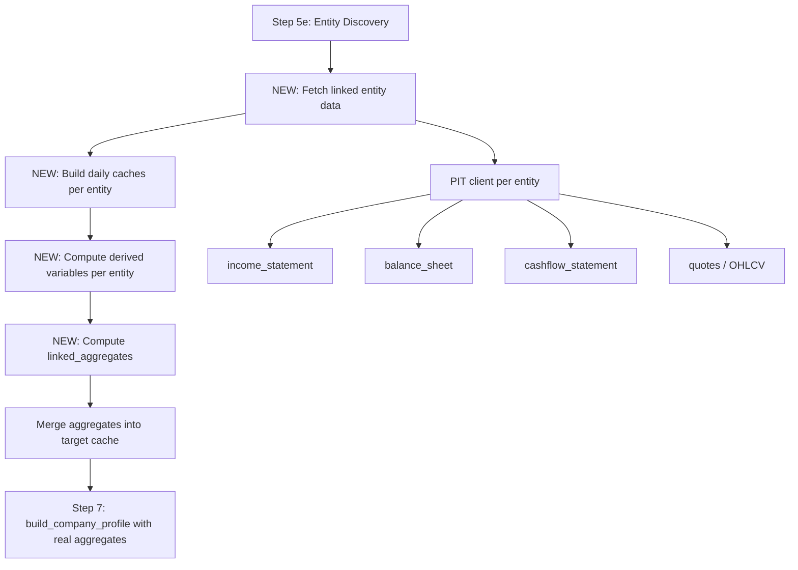

# Linked Entity Data Integration Plan

## Problem

Entity discovery works correctly -- the pipeline finds competitors, suppliers, customers, etc. across all 25 markets via LLM + cross-region PIT search. However, the discovered entities' **financial data is never fetched**, and two fully-implemented modules are never called:

1. **`linked_aggregates.py`** -- Computes mean/median financial metrics across relationship groups
2. **`portfolio_analysis.py`** -- Computes institutional ownership overlap and user portfolio context

The result: `linked_aggregates=None` is hardcoded at `main.py:1479`, and the report lacks peer comparison data.

## Architecture

The existing modules already define the exact interfaces needed. The gap is purely in `main.py` pipeline wiring.

## Implementation Steps

### Step 1: Add linked entity data fetching after discovery in main.py

**Location:** After `main.py:1020` (entity discovery complete), before graph_risk

**What it does:**
- For each discovered linked entity, determine the correct PIT client using `create_pit_client()` with the entity's market_id
- Fetch financial statements + OHLCV in parallel (ThreadPoolExecutor, 4 workers)
- Build a daily cache per entity using the same as-of merge logic as the target
- Run `compute_derived_variables()` on each linked entity cache
- Cap at ~10 entities total to stay within API budgets (configurable)
- Skip entities whose data fetch fails (graceful degradation)

**Key data structures:**
- `linked_caches: dict[str, pd.DataFrame]` -- maps entity ISIN/ticker to their daily cache
- `entity_groups: dict[str, list[str]]` -- maps relationship group to member ISINs (already available from DiscoveryResult)

### Step 2: Compute linked aggregates

**Location:** After linked caches are built, before Step 6

**What it does:**
- Call `compute_linked_aggregates()` from `linked_aggregates.py` with:
  - `target_daily=cache` (the target's daily cache)
  - `linked_daily=linked_caches` (all linked entity caches)
  - `entity_groups` (from DiscoveryResult, mapping group names to ISINs)
  - `entity_temporal` (relationship start/end dates from LinkedEntity metadata)
- Merge the resulting aggregate columns into the target cache
- This produces columns like `competitors_avg_return_1d`, `suppliers_median_debt_to_equity_abs`, etc.

### Step 3: Pass aggregates to profile builder

**Location:** `main.py:1479`

**What it does:**
- Change `linked_aggregates=None` to `linked_aggregates=linked_agg_df`
- The profile builder already handles non-None aggregates

### Step 4: Feed linked caches to model_synergies

**Location:** `main.py:1197` (pre-forecasting synergies)

**What it does:**
- Change `linked_caches=None` to `linked_caches=linked_caches`
- `apply_pre_forecasting_synergies()` already accepts this parameter

### Step 5: Feed linked caches to peer_ranking

**Location:** After linked aggregates are computed

**What it does:**
- Import and call `compute_peer_ranking()` from `peer_ranking.py`
- Pass the target cache and linked caches
- Feed the result to `build_company_profile(peer_ranking_result=...)`

## Design Constraints

1. **API budget awareness** -- Limit linked entity fetching to top N entities (default 10) to avoid exhausting free-tier API limits
2. **Parallel fetching** -- Use ThreadPoolExecutor to fetch 4 entities simultaneously
3. **Graceful degradation** -- If any entity fetch fails, continue with what we have. The pipeline must never crash due to a linked entity.
4. **Disk caching** -- Use `data_extraction.py`'s existing cache layer so repeated runs don't re-fetch
5. **No portfolio_analysis wiring** -- This requires user input (portfolio holdings string) which is not part of the current CLI flow. Note it as a future integration point.

## Files Modified

| File | Change |
|------|--------|
| `main.py` | Add Step 5f (linked data fetch), Step 5g (linked aggregates), wire to profile builder and synergies |

## Risk Assessment

- **Low risk** -- All downstream modules already handle None/empty inputs gracefully
- **Performance** -- Adds ~2-5 minutes for 10 linked entities (parallel fetch)
- **API limits** -- Alpha Vantage free tier: 25 calls/day. With 10 linked entities needing OHLCV, this could hit the limit. Mitigated by disk caching.
