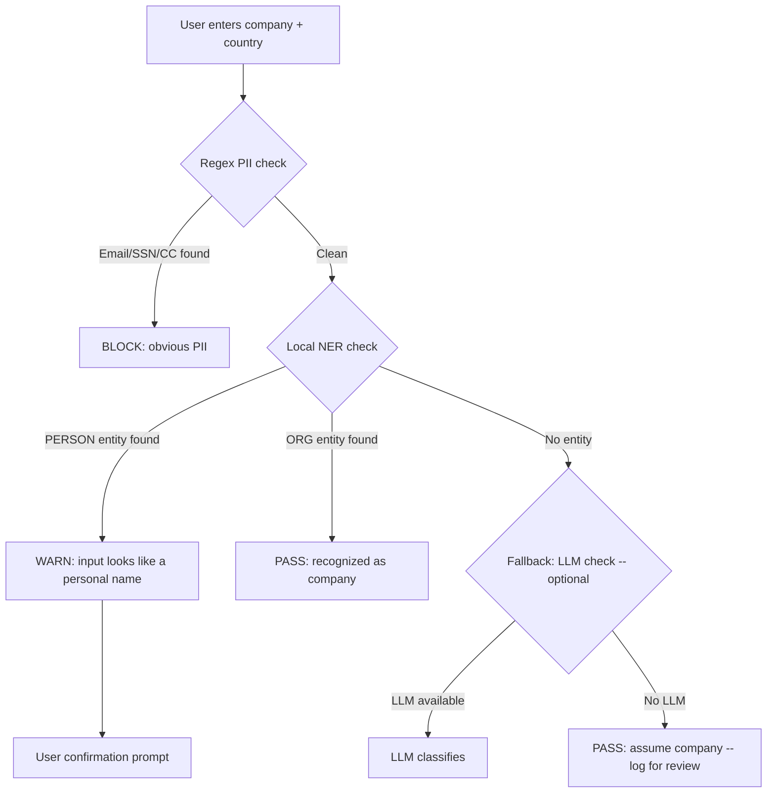

# Local NER Model for PII Detection + Solutions for Identified Issues

---

## Part A: Local NER Model Plan (Replace LLM PII Check)

### Problem
The current `personal_data_guard.py` sends user input to Google/Anthropic for PII classification. This is ironic -- sending potentially personal data to a third party to check if it's personal.

### Solution: Local Named Entity Recognition (NER)

Use a small, pre-trained NER model that runs locally with zero network calls. The model distinguishes PERSON entities from ORG entities, solving the exact ambiguity the LLM was handling (is "John Smith" a person or a company?).

### Recommended Model: spaCy `en_core_web_sm`

| Property | Value |
|----------|-------|
| Library | spaCy |
| Model | `en_core_web_sm` (12MB) or `en_core_web_md` (40MB) |
| Entity types | PERSON, ORG, GPE, LOC, DATE, MONEY, etc. |
| Speed | ~10,000 texts/second on CPU |
| Accuracy | ~85% F1 on entity recognition |
| Network calls | Zero -- fully local |
| License | MIT |

### Architecture



### Implementation Plan

**File: `operator1/clients/personal_data_guard.py`**

#### Step 1: Add spaCy NER function

```python
def _check_pii_ner(text: str) -> list[str]:
    """Check text for personal names using local spaCy NER.
    
    Returns warnings if PERSON entities are found.
    No network calls -- fully local inference.
    """
    try:
        import spacy
        # Load small English model (12MB, cached after first load)
        nlp = spacy.load("en_core_web_sm")
    except (ImportError, OSError):
        return []  # spaCy not installed -- skip NER check
    
    doc = nlp(text)
    warnings = []
    
    for ent in doc.ents:
        if ent.label_ == "PERSON":
            warnings.append(
                f"Input '{ent.text}' appears to be a personal name "
                f"(NER confidence: {ent.label_}), not a company"
            )
    
    return warnings
```

#### Step 2: Update check_user_input_for_pii flow

```python
def check_user_input_for_pii(company, country, llm_client=None):
    # Step 1: Regex (fast, always runs)
    regex_warnings = _check_pii_regex(combined_input)
    if regex_warnings: return result_with_warnings
    
    # Step 2: Local NER (fast, no network, new)
    ner_warnings = _check_pii_ner(company)
    if ner_warnings: return result_with_warnings
    
    # Step 3: LLM (optional, only for edge cases)
    # This step becomes the LAST resort, not the primary check
    if llm_client is not None:
        # ... existing LLM check (unchanged)
```

#### Step 3: Add spaCy to optional dependencies

```
# requirements.txt
# Phase 4: Privacy (optional -- local PII detection)
# spacy>=3.5               # Local NER for PII detection (no network calls)
# Run: python -m spacy download en_core_web_sm
```

#### Step 4: Model download helper

Add to `run.py` startup:
```python
def _ensure_ner_model():
    """Download spaCy NER model if not present."""
    try:
        import spacy
        spacy.load("en_core_web_sm")
    except OSError:
        _info("Downloading local PII detection model (12MB, one-time)...")
        import subprocess
        subprocess.run([sys.executable, "-m", "spacy", "download", "en_core_web_sm"], 
                      check=False, capture_output=True)
    except ImportError:
        pass  # spaCy not installed -- skip
```

### NER vs LLM Comparison

| Aspect | Regex | Local NER (spaCy) | LLM (Gemini/Claude) |
|--------|-------|-------------------|---------------------|
| Speed | <1ms | ~5ms | 500-2000ms |
| Network | None | None | Required |
| Privacy | Full | Full | Sends data to third party |
| Accuracy | Pattern-only | ~85% F1 entities | ~95% contextual |
| Cost | Free | Free | API credits |
| Handles "John Smith" | No | Yes (PERSON) | Yes |
| Handles "Smith & Wesson" | No | Yes (ORG) | Yes |
| Handles ambiguous names | No | Partial | Good |

### Recommended: 3-Layer Detection Stack

1. **Layer 1 -- Regex** (always): catches email, SSN, credit card, phone, IP
2. **Layer 2 -- NER** (if spaCy installed): catches personal names vs company names
3. **Layer 3 -- LLM** (if available + NER inconclusive): handles edge cases

This gives privacy-first behavior (no data leaves the machine unless NER can't decide and LLM is available).

---

## Part B: Solutions for Other Identified Issues

### Solution B1: Cross-Standard Comparison Caveat

**Problem**: The canonical translator maps 8 standards to one schema without warning users.

**Solution**: Add a `standard_caveats` field to the company profile and inject it into the report.

**File changes**:
- `profile_builder.py`: Add `profile["meta"]["accounting_standard"]` from the market_info
- `report_generator.py`: Add a "Data Sources & Methodology" section to all report tiers that says:
  ```
  "Financial data sourced from {pit_api_name} ({country}). 
  Accounting standard: {standard}. 
  Cross-market comparisons should note that {standard} and US-GAAP 
  may define similar metrics differently."
  ```

**Standard mapping** (add to `canonical_translator.py`):
```python
_MARKET_STANDARD: dict[str, str] = {
    "us_sec_edgar": "US-GAAP",
    "uk_companies_house": "UK-GAAP / IFRS",
    "eu_esef": "IFRS",
    "jp_edinet": "JPPFS / IFRS",
    "kr_dart": "K-IFRS",
    "tw_mops": "TIFRS",
    "br_cvm": "BR-GAAP / IFRS",
    "cl_cmf": "IFRS (Chile)",
    "cn_sse": "CAS (Chinese Accounting Standards)",
    "in_bse": "Ind AS (IFRS-converged)",
}
```

### Solution B2: Estimation Transparency in Reports

**Problem**: Estimated values are indistinguishable from observed values in the report.

**Solution**: The `is_missing_*` flags and `estimation_coverage.json` already track this. Surface it.

**File changes**:
- `profile_builder.py`: Add `profile["data_quality"]["estimated_fields"]` listing all fields where >50% of values are estimated
- `report_generator.py`: Add footnotes to the report:
  ```
  "[E]" next to any metric that was estimated rather than reported.
  e.g., "Revenue: $45.2B | EBITDA: $12.1B [E] | Free Cash Flow: $8.3B"
  ```

### Solution B3: UK iXBRL Integration

**Problem**: UK Companies House returns zero financial data.

**Solution**: Add `ixbrl-parse` to extract financial values from iXBRL documents.

**Implementation outline**:
1. `uk_ch_wrapper.py._fetch_financials_from_filings()` already gets filing transaction IDs
2. Add: download the iXBRL document using the transaction ID
3. Parse with `ixbrl-parse` to extract tagged financial values
4. Map iXBRL tags to canonical fields via `_UKGAAP_MAP`

**Dependency**: `ixbrl-parse>=0.10.1` (found in research, MIT license)

### Solution B4: data_mode Wiring

**Problem**: `data_mode` is cosmetic -- never reaches main.py.

**Recommended approach**: Keep it cosmetic. The wrapper clients already internally handle both modes (library primary, gov API fallback). The mode toggle controls:
- Whether to prompt for market-specific API keys
- Whether to display API registration privacy warnings

This is the correct behavior. No code change needed -- just update the UI description from "Wrappers only" to "Standard (automatic)" and "API + Wrappers" to "Enhanced (may need API keys)".

### Solution B5: Strategic Sectors List

**Problem**: Static YAML list of strategic sectors may be outdated.

**Solution**: Hybrid approach:
1. Keep the YAML as a baseline
2. At runtime, ask the LLM: "Is {company} in {sector} considered strategically important for {country}'s government? Consider recent industrial policy."
3. Combine: if YAML says yes OR LLM says yes, flag as protected
4. Cache the LLM response per company/country pair

This is a report enhancement, not a pipeline change. Low risk.

---

## Priority Order

| Priority | Item | Complexity | Impact |
|----------|------|-----------|--------|
| 1 | Local NER model (Part A) | Medium | High -- fixes privacy irony |
| 2 | Estimation transparency (B2) | Low | High -- builds trust |
| 3 | Cross-standard caveat (B1) | Low | Medium -- improves accuracy |
| 4 | UK iXBRL integration (B3) | High | High -- unlocks UK market |
| 5 | Strategic sectors hybrid (B5) | Medium | Low -- niche feature |
| 6 | data_mode label fix (B4) | Trivial | Low -- cosmetic |
