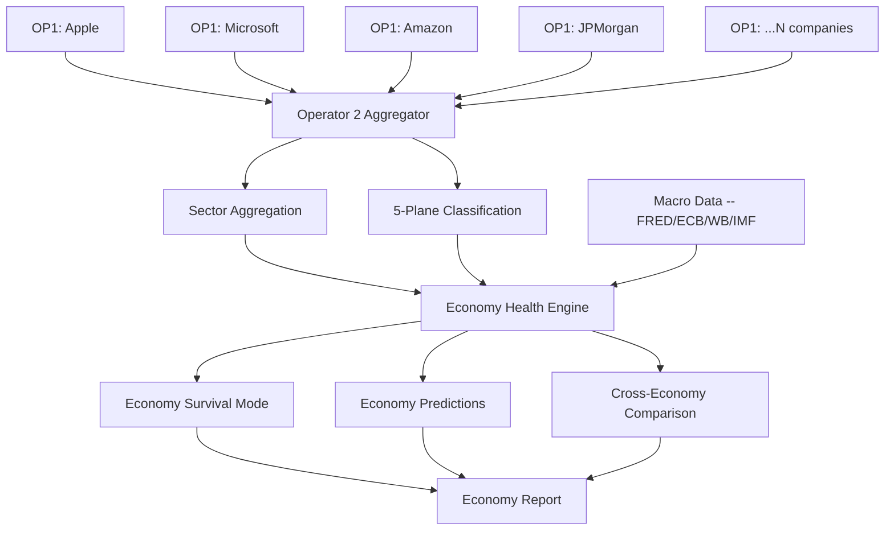

# Operator 2 -- Economy-Level Prediction Engine

## Core Idea

Operator 1 analyzes individual companies. Operator 2 takes the OUTPUT of many Operator 1 runs and aggregates them to predict the health, trajectory, and risks of entire economies.

The insight: if you have deep financial analysis of the top 50-200 companies in a country (representing 60-80% of GDP), you can infer the economy's direction bottom-up -- often months before official government statistics are released.

---

## Architecture



---

## Input: What Operator 1 Already Produces

Each OP1 run generates `company_profile.json` with:

| Data Available | How OP2 Uses It |
|---------------|----------------|
| `identity.sector`, `identity.industry` | Classify company into economic sector |
| `current_state.revenue`, `.net_income`, `.total_assets` | GDP component estimation |
| `current_state.debt_to_equity`, `.current_ratio` | Sector-level leverage/liquidity |
| `survival.company_survival_flag` | Economy distress signal (% of companies in survival) |
| `survival.vanity_percentage` | Capital allocation efficiency |
| `predictions.close.1d/5d/21d/252d` | Forward-looking market expectations |
| `financial_health.composite_score` | Sector-level health |
| `macro_quadrant` | Current macro regime |
| `regime_label` | Market regime (bull/bear/volatile) |
| `monte_carlo.percentiles` | Probability distribution of outcomes |
| `ethical_filters` | Solvency/gharar distribution across economy |

---

## Operator 2 Modules

### Module 1: Company Universe Builder
**Purpose**: Define which companies represent an economy.

```
Input: Country code (e.g., "US", "JP", "KR")
Process:
  1. Query OP1's pit_registry for all markets in that country
  2. Get top N companies by market cap from the PIT client
  3. Classify each into the 5 economic planes:
     - Supply (raw materials, mining, energy)
     - Manufacturing (industrials, tech hardware)
     - Consumption (retail, consumer, services)
     - Logistics (transport, telecom, utilities)
     - Financial Services (banks, insurance, asset mgmt)
  4. Weight by market cap contribution to GDP
Output: Company universe with sector/plane weights
```

### Module 2: Batch OP1 Runner
**Purpose**: Run Operator 1 on all companies in the universe.

```
Input: Company universe (50-200 companies)
Process:
  1. For each company, run: python main.py --market {id} --company {ticker} --skip-linked --output-dir batch/{ticker}
  2. Parallelize across 4-8 workers (respect API rate limits)
  3. Collect all company_profile.json files
  4. Handle failures gracefully (some companies may fail)
Output: Directory of company profiles + run summary
```

Estimated runtime for 100 US companies: ~2-4 hours (30 min each, 4 parallel workers).

### Module 3: Sector Aggregator
**Purpose**: Roll up company-level metrics to sector and economy level.

```
For each sector:
  - Revenue weighted average: sum(company_revenue * company_weight)
  - Survival rate: count(survival_flag=1) / total_companies
  - Average financial health score
  - Debt-to-equity distribution (median, p25, p75)
  - Vanity expenditure aggregate
  - Regime distribution (% bull, % bear, % volatile)
  
For the whole economy:
  - GDP-weighted aggregate of all sector metrics
  - Cross-sector correlation matrix
  - Contagion risk: how correlated are sector distress signals?
```

### Module 4: Economy Health Scorer
**Purpose**: Produce a single economy health score (0-100) from aggregated data.

**Scoring methodology**:

| Component | Weight | Source | Score Range |
|-----------|--------|--------|-------------|
| Corporate earnings momentum | 20% | YoY revenue/earnings growth across sectors | 0-100 |
| Solvency health | 20% | Debt-to-equity distribution, % in survival mode | 0-100 |
| Cash flow quality | 15% | Free cash flow yield across sectors | 0-100 |
| Employment proxy | 15% | Revenue per employee trends (if available) | 0-100 |
| Market expectations | 15% | Aggregated OP1 predictions (bullish vs bearish) | 0-100 |
| Vanity/efficiency | 10% | Capital allocation quality (inverse of vanity %) | 0-100 |
| Regime stability | 5% | % of companies in stable regime vs volatile | 0-100 |

**Output**: Economy health score + breakdown + trend (improving/stable/deteriorating).

### Module 5: Economy Prediction Engine
**Purpose**: Forward-looking economy predictions based on company-level forecasts.

**Approach 1: Bottom-up GDP nowcasting**
- Sum company revenue forecasts (weighted by GDP contribution)
- Compare to official GDP figures for calibration
- The insight: corporate filings are released quarterly, but OP1's forward pass predicts daily -- giving you a GDP nowcast months before official release

**Approach 2: Survival cascade model**
- Track the % of companies entering survival mode over time
- Model: logistic regression of "economy recession" on survival_rate, leverage_ratio, cash_flow_yield
- Historical calibration: map past company survival rates to actual recessions

**Approach 3: Cross-sector leading indicators**
- Financial sector distress leads real economy by 6-12 months
- Supply chain (logistics + manufacturing) distress leads consumption by 3-6 months
- Build a Granger causality network across sectors

### Module 6: Cross-Economy Comparator
**Purpose**: Compare economies to each other.

```
Example output:
  US Economy Health: 72/100 (stable)
  Japan Economy Health: 65/100 (improving)
  South Korea Economy Health: 68/100 (deteriorating)
  
  Cross-economy correlation: US-JP 0.65, US-KR 0.71, JP-KR 0.82
  Contagion risk: HIGH between KR and JP (shared supply chains)
```

### Module 7: Economy Report Generator
**Purpose**: LLM-generated economy analysis report.

Tiers:
- **Economy Basic**: Health score, sector breakdown, 1-page summary
- **Economy Pro**: Full analysis with predictions, cross-sector dynamics, risk flags
- **Economy Premium**: Multi-economy comparison, contagion analysis, policy impact scenarios

---

## Data Flow

```
Day 1: Run OP1 on 100 US companies (batch)
        -> 100 company_profile.json files
        
Day 2: Run OP2 aggregation
        -> us_economy_profile.json
        -> Sector health scores
        -> GDP nowcast
        -> Economy health score: 72/100
        
Day 3: Run OP1 on 80 Japan companies
        -> 80 company_profile.json files
        
Day 4: Run OP2 on Japan + cross-economy comparison
        -> jp_economy_profile.json
        -> US vs JP comparison report
```

---

## Technical Stack (Reusing OP1 Infrastructure)

| OP1 Component | OP2 Reuse |
|--------------|-----------|
| `pit_registry.py` | Universe building -- which companies in which market |
| `canonical_translator.py` | All data already in canonical format |
| `macro_client.py` | Country-level macro data (GDP, CPI, rates) |
| `survival_mode.py` | Company-level survival flags as input |
| `hierarchy_weights.py` | Sector weighting methodology |
| `economic_planes.py` | 5-plane classification |
| `regime_detector.py` | Per-company regime as input to aggregate regime |
| `monte_carlo.py` | Scenario simulation at economy level |
| `report_generator.py` | LLM-based report generation (same pattern, different prompt) |
| `llm_factory.py` | Same LLM integration |
| `http_utils.py` | Same caching/rate-limiting |

**New modules needed**:

| Module | Purpose | Complexity |
|--------|---------|-----------|
| `operator2/universe_builder.py` | Build company universe per country | Medium |
| `operator2/batch_runner.py` | Parallel OP1 execution | Medium |
| `operator2/sector_aggregator.py` | Roll up company -> sector -> economy | High |
| `operator2/economy_scorer.py` | Economy health score (0-100) | Medium |
| `operator2/economy_predictor.py` | GDP nowcast, recession probability | High |
| `operator2/cross_economy.py` | Multi-economy comparison | Medium |
| `operator2/economy_report.py` | LLM-generated economy reports | Medium |

---

## Pricing (Freelance)

| Report Type | Companies Analyzed | Price |
|-------------|-------------------|-------|
| Economy Snapshot (Basic) | Top 30 companies | $500-1,000 |
| Economy Deep Dive (Pro) | Top 100 companies | $2,000-5,000 |
| Multi-Economy Comparison | 2-3 economies, 50 each | $5,000-15,000 |
| Quarterly Economy Monitor (subscription) | 100+ companies, 4x/year | $10,000-25,000/year |

**Target customers**: Sovereign wealth funds, central bank research departments, multinational corporate strategy teams, macroeconomic research firms, risk consulting firms.

---

## Implementation Phases

### Phase 1: Batch Runner + Sector Aggregator
- Build `batch_runner.py` to run OP1 on N companies
- Build `sector_aggregator.py` to roll up results
- Output: JSON with sector-level metrics
- Deliverable: First "US Economy Health" report from 50 companies

### Phase 2: Economy Health Score + Predictions
- Build scoring model calibrated against historical data
- Build GDP nowcasting from revenue forecasts
- Output: Economy health score with trend

### Phase 3: Cross-Economy + Reports
- Build comparator module
- Build LLM report generator for economy-level analysis
- Deliverable: First multi-economy comparison report

### Phase 4: Automation + Monitoring
- Scheduled batch runs (weekly/monthly)
- Dashboard for tracking economy health over time
- Alert system: economy health drops below threshold

---

## Why This Works

1. **No one else does this**: Bloomberg has country-level data, but it doesn't aggregate company-level PIT analysis into economy predictions. This is genuinely novel.

2. **The data is already flowing**: OP1's 25-market coverage means you can analyze companies in most major economies today.

3. **Bottom-up beats top-down**: Government GDP statistics are lagged by months. Corporate filings are near-real-time. You can predict GDP direction before the government reports it.

4. **Network effects**: The more companies you analyze, the better your economy predictions get. Each new OP1 run improves the OP2 aggregate.

---

*The companies tell the story of the economy. Operator 2 reads the story.*
