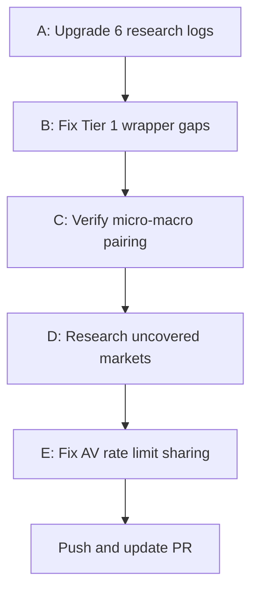

# Phase 2: Wrapper Completeness and Coverage Gaps

## Current State (after Phase 1 PR)

### Tier 1 Markets -- Gov API / Wrapper / Library Matrix

| Region | Gov API Client | Wrapper Client | Unofficial Library | Status |
|--------|---------------|----------------|-------------------|--------|
| US | `sec_edgar.py` | `us_edgar.py` | edgartools + sec-edgar-api | BOTH MODES OK |
| UK | `companies_house.py` | `uk_ch_wrapper.py` | **NONE** | Gov-only, financial gap |
| EU | `esef.py` | `eu_esef_wrapper.py` | pyesef | BOTH MODES OK |
| JP | `edinet.py` | `jp_edinet_wrapper.py` | edinet-tools | BOTH MODES FIXED |
| KR | `dart.py` | `kr_dart_wrapper.py` | dart-fss | BOTH MODES OK |
| TW | `mops.py` | `tw_mops_wrapper.py` | **NONE** (scraper) | Gov scraper only |
| BR | `cvm.py` | `br_cvm_wrapper.py` | pycvm (unused!) | pycvm imported but not used |
| CL | `cmf.py` | `cl_cmf_wrapper.py` | **NONE** | Gov-only, unverified endpoints |

### Tier 2 Markets -- Stub Clients Only (No Wrappers)

| Region | Stub Client | Market Cap | Wrapper? | Unofficial Library? | Macro Source? |
|--------|------------|-----------|----------|---------------------|---------------|
| CA | `ca_sedar.py` | ~$3T | NO | NO | NO (World Bank only) |
| AU | `au_asx.py` | ~$1.8T | NO | NO | NO |
| IN | `in_bse.py` | ~$4T | NO | NO | NO |
| CN | `cn_sse.py` | ~$10T | NO | NO | NO |
| HK | `hk_hkex.py` | ~$4.5T | NO | NO | NO |
| SG | `sg_sgx.py` | ~$0.6T | NO | NO | NO |
| MX | `mx_bmv.py` | ~$0.5T | NO | NO | NO |
| ZA | `za_jse.py` | ~$1T | NO | NO | NO |
| CH | `ch_six.py` | ~$1.8T | NO | NO | NO |
| AE | `ae_dfm.py` | ~$0.8T | NO | NO | NO |
| SA | `sa_tadawul.py` | ~$2.8T | NO | NO | NO |
| NL/ES/IT/SE | reuse `eu_esef_wrapper` | various | YES (reuse) | pyesef | ECB (via EU) |

### Micro -> Macro Mapping (Current)

| Region | Micro PIT Source | Macro Source | Fetcher Type | Dedicated or Generic? |
|--------|-----------------|-------------|-------------|----------------------|
| US | SEC EDGAR | FRED | `fredapi` | **Dedicated** |
| EU | ESEF | ECB SDW | `sdmx1` | **Dedicated** |
| UK | Companies House | ONS | generic | Generic (JSON) |
| DE | ESEF (DE) | Bundesbank | dedicated | **Dedicated** |
| FR | ESEF (FR) | INSEE | generic | Generic |
| JP | EDINET | e-Stat | generic | Generic |
| KR | DART | KOSIS | generic | Generic |
| TW | MOPS | DGBAS | generic | Generic |
| BR | CVM | BCB | dedicated | **Dedicated** |
| CL | CMF | BCCh | generic | Generic |
| ALL | any | World Bank | `wbgapi` | **Global fallback** |

**Tier 2 markets have NO dedicated macro fetchers -- only World Bank fallback.**

---

## Phase 2 Work Items

### A. Upgrade 6 Research Logs to Verbatim Standard

These logs need PART A / PART B headers and verbatim code from fetched docs:

1. **EU ESEF** -- Fetch pyesef README, filings.xbrl.org API docs
2. **Taiwan MOPS** -- Fetch MOPS page to verify form endpoints
3. **Brazil CVM** -- Fetch pycvm README, CVM API docs
4. **Chile CMF** -- Fetch CMF website to verify endpoints
5. **Alpha Vantage** -- Add PART A/B headers for consistency
6. **Macro Client** -- Fetch fredapi/wbgapi/sdmx1 READMEs, add verbatim code

### B. Fix Wrapper Gaps for Tier 1 Markets

| Market | Issue | Action |
|--------|-------|--------|
| UK | No unofficial wrapper, financial data gap | Research if any community iXBRL parsing library exists for UK Companies House |
| TW | No unofficial wrapper, scraper-only | Search PyPI for MOPS/TWSE wrappers |
| BR | pycvm imported but not actually used | Either wire pycvm properly or document as gov-API-only |
| CL | No unofficial wrapper, endpoints unverified | Fetch CMF website to verify JSON availability |

### C. Verify Micro-Macro Pairing Completeness

Every micro PIT source needs a corresponding macro source. Current gaps:

| Issue | Detail |
|-------|--------|
| UK ONS uses "generic" fetcher | ONS has a proper JSON API -- should get a dedicated fetcher |
| FR INSEE uses "generic" fetcher | INSEE has an SDMX endpoint -- could use sdmx1 |
| JP e-Stat uses "generic" fetcher | e-Stat has a proper JSON API with app ID |
| KR KOSIS uses "generic" fetcher | KOSIS has a JSON API with app key |
| TW DGBAS uses "generic" fetcher | DGBAS data may not be accessible via generic JSON |
| CL BCCh uses "generic" fetcher | BCCh has a specific API format |

**Recommendation**: Upgrade the 6 "generic" macro fetchers to use their actual API patterns. The generic fetcher attempts to auto-detect date/value columns from JSON, which is fragile.

### D. Research Uncovered Markets

Markets by market cap NOT yet in the registry:

| Country | Exchange | Market Cap | Gov Disclosure API | Priority |
|---------|----------|-----------|-------------------|----------|
| Indonesia | IDX | ~$0.5T | OJK | Low |
| Thailand | SET | ~$0.5T | SET | Low |
| Malaysia | Bursa | ~$0.4T | Bursa Malaysia | Low |
| Poland | GPW | ~$0.2T | KNF | Low |
| Turkey | BIST | ~$0.2T | BIST | Low |
| Israel | TASE | ~$0.3T | ISA MAGNA | Medium |
| Philippines | PSE | ~$0.2T | PSE | Low |

**Note**: Most Tier 2 markets already cover the top-15 global exchanges by market cap. The remaining uncovered markets are all below $0.5T and lower priority.

### E. Fix Alpha Vantage Rate Limit Sharing

[`news_sentiment.py`](operator1/features/news_sentiment.py:111) calls Alpha Vantage but doesn't decrement the shared counter in [`ohlcv_provider.py`](operator1/clients/ohlcv_provider.py:39). Fix: import and call `_increment_av_counter()` from news_sentiment.

---

## Execution Order

Each step follows the full research protocol:
1. Fetch actual docs via curl
2. Extract verbatim code
3. Write research log with PART A / PART B separation
4. Apply code fixes
5. Commit with source references

---

## Priority Assessment

| Item | Priority | Reason |
|------|---------|--------|
| A: Upgrade 6 logs | HIGH | Protocol compliance |
| B: UK financial gap | HIGH | Major data gap for Tier 1 market |
| C: Generic macro fetchers | MEDIUM | Fragile but functional via World Bank fallback |
| D: New markets | LOW | Tier 2 already covers top-15 exchanges |
| E: AV rate limit fix | LOW | Only affects sessions using both OHLCV + news |
