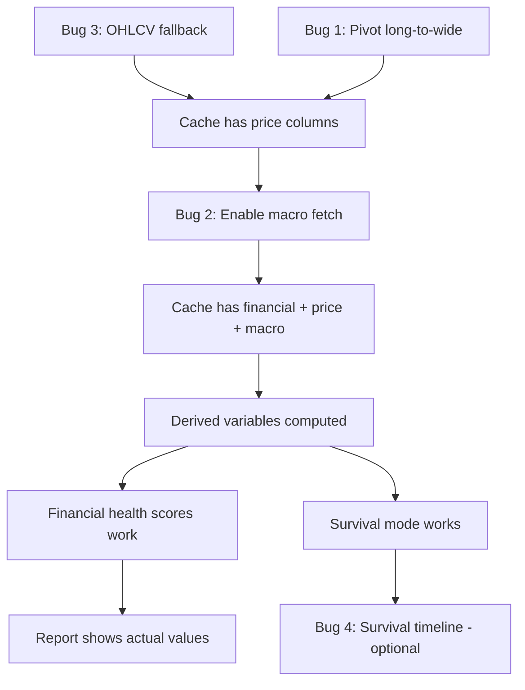

# Pipeline Bug Fix Plan

## Problem

Running `python3 main.py --market us_sec_edgar --company AAPL` fetches 180 income, 164 balance, 72 cashflow rows from SEC EDGAR, but the report shows all N/A because the data never reaches the cache or downstream modules.

## 4 Bugs Identified

### Bug 1: Financial data not merged into cache (CRITICAL)

**File**: [`main.py`](main.py:727) lines 727-763

**Symptom**: "Cache built: 523 rows x 0 columns"

**Root cause**: Financial statement DataFrames are in **long format**:
```
concept | value | canonical_name | filing_date | report_date
revenue | 210B  | revenue        | 2024-05-03  | 2024-03-30
```

The cache builder at line 745 does `select_dtypes(include=["number"])` which only finds `value` and `fiscal_year` columns -- not the actual metric names. It expects **wide format**:
```
filing_date | revenue | net_income | total_assets | ...
2024-05-03  | 210B    | 95B        | 352B         | ...
```

**Fix**: Call [`pivot_to_canonical_wide()`](operator1/clients/canonical_translator.py:803) on each statement DataFrame before the merge loop. This function already exists and does exactly what's needed.

**Location**: [`main.py`](main.py:727) -- add 3 lines before the merge loop at line 727:
```python
from operator1.clients.canonical_translator import pivot_to_canonical_wide
income_df = pivot_to_canonical_wide(income_df, date_col="filing_date")
balance_df = pivot_to_canonical_wide(balance_df, date_col="filing_date")
cashflow_df = pivot_to_canonical_wide(cashflow_df, date_col="filing_date")
```

---

### Bug 2: Macro data fetching disabled (CRITICAL)

**File**: [`main.py`](main.py:770) lines 770-778

**Symptom**: "Step 4a: Macro data fetching skipped (government macro APIs removed)"

**Root cause**: Lines 770-778 hardcode `macro_data = {}` and skip the fetch entirely. The [`macro_provider.fetch_macro()`](operator1/clients/macro_provider.py) function exists and works (tested with FRED API key).

**Fix**: Replace the skip block with an actual call to `fetch_macro()`:
```python
from operator1.clients.macro_provider import fetch_macro
macro_data = fetch_macro(
    market_info.country_code,
    secrets=secrets,
    years=int(args.years),
)
```

**Location**: [`main.py`](main.py:770) -- replace lines 770-778

---

### Bug 3: OHLCV not fetched when PIT source has no prices (HIGH)

**File**: [`main.py`](main.py) -- after quotes_df fetch

**Symptom**: "Quotes: 0 rows" + "PIT source SEC EDGAR does not provide OHLCV -- price features will be limited"

**Root cause**: SEC EDGAR's `get_quotes()` returns empty (EDGAR has no price data). The pipeline should call [`ohlcv_provider.fetch_ohlcv()`](operator1/clients/ohlcv_provider.py) as a fallback, but it never does.

**Fix**: After the PIT `get_quotes()` call returns empty, call the OHLCV provider:
```python
if quotes_df.empty:
    from operator1.clients.ohlcv_provider import fetch_ohlcv
    quotes_df = fetch_ohlcv(
        target_profile.get("ticker", args.company),
        market_id=args.market,
    )
```

**Location**: [`main.py`](main.py) -- find the "Quotes: 0 rows" log line and add the fallback after it

---

### Bug 4: Survival timeline not wired into pipeline (LOW)

**File**: [`operator1/analysis/survival_timeline.py`](operator1/analysis/survival_timeline.py) exists but is never imported in [`main.py`](main.py)

**Symptom**: Report shows "0 episodes" with no timeline analysis

**Root cause**: The module exists and has tests, but `main.py` never calls it. This is a missing integration, not a code bug.

**Fix**: Wire it in after the survival mode flag computation at line 852. Lower priority since it depends on Bugs 1-3 being fixed first.

---

## Implementation Order



## Checklist

- [ ] Bug 3: Add OHLCV fallback to fetch_ohlcv when PIT has no prices
- [ ] Bug 1: Call pivot_to_canonical_wide before cache merge loop
- [ ] Bug 2: Enable macro_provider.fetch_macro call
- [ ] Bug 4: Wire survival_timeline into pipeline (optional)
- [ ] Re-run AAPL pipeline and verify report has actual values
- [ ] Commit and push to PR
