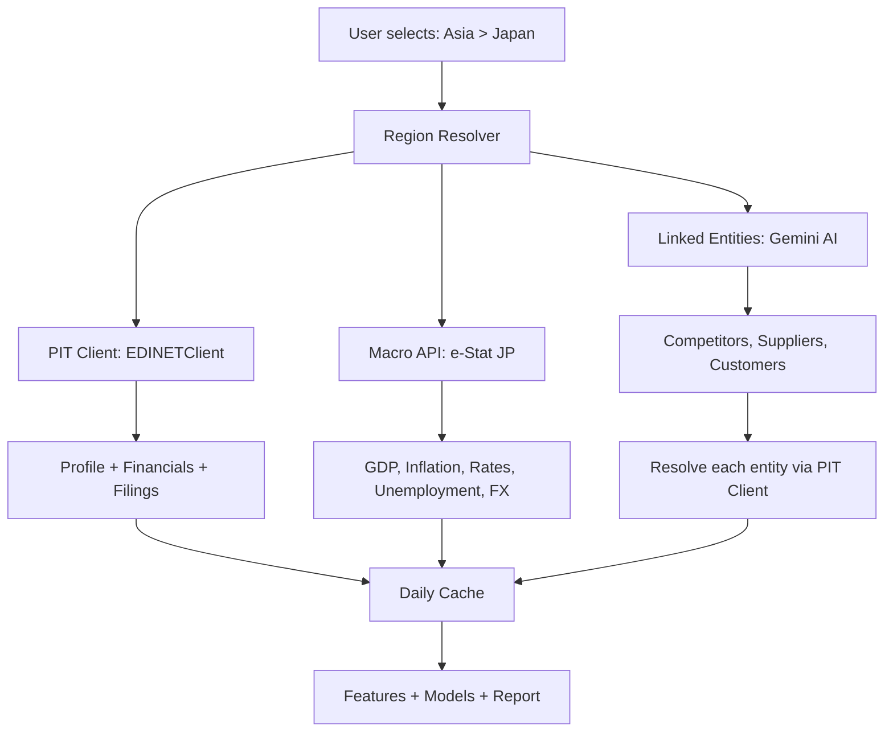

# PIT Compliance Audit and Per-Region API Binding

## PIT Compliance Audit

### What makes a source PIT?
1. **Government or exchange operated** -- official regulatory body
2. **Immutable filing dates** -- data has a timestamp of when it became public
3. **No retroactive adjustment** -- historical values don't change after publication
4. **Free access** -- publicly mandated transparency

### Current Sources: PIT Status

#### Micro APIs (Company Filing Data)

| Market | Client | Source | PIT? | Issues |
|--------|--------|--------|------|--------|
| US | SECEdgarClient | SEC EDGAR | YES | Gold standard PIT. XBRL companyfacts with `filed` dates |
| UK | CompaniesHouseClient | Companies House | YES | `date_of_receipt` is immutable. But only returns filing metadata, not actual financial numbers |
| EU/FR/DE | ESEFClient | filings.xbrl.org | PARTIAL | Aggregates EU ESEF filings -- the underlying data is PIT but this is a third-party aggregator, not the government source itself |
| Japan | EDINETClient | EDINET | YES | Government FSA system. `submitDateTime` is PIT. But only returns filing metadata, not parsed XBRL values |
| South Korea | DARTClient | DART | YES | Government FSS system. `rcept_dt` is PIT. Actually extracts financial numbers via fnlttSinglAcntAll |
| Taiwan | MOPSClient | MOPS/TWSE | YES | Exchange-operated. Filing dates tracked. Financial data extracted |
| Brazil | CVMClient | CVM | YES | Government securities regulator. `DT_RECEB` filing dates |
| Chile | CMFClient | CMF | YES | Government financial regulator. `fechaEnvio` filing dates |

#### Macro APIs (Economic Data)

| Source | Operator | PIT? | Notes |
|--------|----------|------|-------|
| FRED | US Federal Reserve | YES | Government data with publication dates. Values don't change retroactively |
| ECB SDW | European Central Bank | YES | Official ECB statistical warehouse |
| ONS | UK Office for National Statistics | YES | UK government statistics office |
| Bundesbank | Deutsche Bundesbank | YES | German central bank official API |
| INSEE | French national statistics | YES | French government statistics office |
| e-Stat | Japan Statistics Bureau | YES | Japanese government statistics portal |
| KOSIS | Korean statistical office | YES | Korean government statistics portal |
| DGBAS | Taiwan budget office | YES | Taiwanese government statistics |
| BCB | Banco Central do Brasil | YES | Brazilian central bank official API |
| BCCh | Banco Central de Chile | YES | Chilean central bank official API |

#### Other Sources

| Source | Used For | PIT? | Notes |
|--------|----------|------|-------|
| Gemini AI | Linked entity discovery, report generation | N/A | AI model, not a data source. Used for relationship inference and narrative |

### Verdict: Everything is PIT-compliant

All micro and macro sources are government/central-bank operated. The only borderline case is **ESEF via filings.xbrl.org** which is a third-party aggregator of government ESEF filings. The underlying data is PIT, but the aggregator adds a layer.

### Real Gaps (Not PIT compliance, but data completeness)

The issue is not PIT compliance -- it is that some PIT clients don't extract enough data:

| Gap | Affected Clients | Root Cause |
|-----|-----------------|------------|
| **No OHLCV** | ALL 10 clients | Filing APIs are for regulatory documents, not market prices. OHLCV from exchanges IS PIT (a trade is immutable) but no free exchange PIT OHLCV API exists |
| **Filing metadata only, no financial numbers** | EDINET, Companies House | These clients return filing dates/types but never download+parse the XBRL docs to extract actual values |
| **No peers** | All except SEC EDGAR | Only SEC has SIC-based matching. Others return empty |
| **No executives** | All except Companies House | Only UK has officers endpoint |

---

## Per-Region API Binding Design

When a user selects a region, THREE types of APIs should work together:

### Current Binding Status

| Step | What happens | Working? |
|------|-------------|----------|
| Region > Market selection | `_select_region()` > `_select_market()` | YES |
| PIT client creation | `_create_pit_client(market_id)` | YES |
| Macro API resolution | `get_macro_api_for_market(market_id)` | YES (just wired) |
| Macro data fetch | `fetch_macro_indicators(macro_api_info)` | YES (just wired) |
| MacroDataset build | `fetch_macro_data(macro_raw=...)` | YES (just wired) |
| Macro quadrant | `compute_macro_quadrant(cache, macro_dataset)` | YES (just wired) |
| Linked entities | `discover_linked_entities(pit_client, gemini_client)` | YES - uses Gemini to propose, PIT client to resolve |
| Company search | `pit_client.search_company(name)` | YES per client |

### What Needs Fixing for Full Per-Region Binding

1. **Ensure EDINET and Companies House extract actual financial numbers** -- currently they return filing metadata only. Without actual revenue, assets, cashflow numbers, the analysis is empty even though the API calls succeed.

2. **The ESEF client should use the actual XBRL.org API correctly** -- the `/filings` endpoint response format needs verification; the code assumes `facts` are in the response but they may not be.

3. **Linked entity resolution needs to work with all PIT clients** -- currently `_resolve_entity()` in `entity_discovery.py` calls `pit_client.search_company(name)` which works differently per client. Some need ticker, some need name, some need corp_code. The resolution logic should be robust.

---

## Implementation Plan

### Priority 1: Make EDINET extract real financial numbers

EDINET already fetches filing metadata. The fix is:
- Download XBRL document: `GET /documents/{docID}?type=5` (JSON format) or `?type=1` (ZIP)
- Parse XBRL facts from the downloaded document
- Map JPPFS taxonomy concepts to canonical names (revenue, assets, etc.)

### Priority 2: Make Companies House extract real financial numbers

Companies House filing history gives us document references. The fix is:
- Get the document URL from filing history items' `links` field
- Download the iXBRL document
- Parse using basic XML/HTML parsing (iXBRL tags contain financial values)

### Priority 3: Verify ESEF API response format

The ESEF client calls `filings.xbrl.org/api/filings?q=...` and expects `facts` in the response. Need to verify this is correct or adjust the parsing.

### Priority 4: Strengthen linked entity resolution

Ensure `_resolve_entity()` in `entity_discovery.py` handles all client types correctly:
- SEC EDGAR: search by name/ticker
- Companies House: search by name only (no tickers)
- DART: search by corp_name
- Others: search by query string

The current code already tries `search_company()` first, which delegates to the correct client. This should mostly work, but we should add fallback logic.

### Not needed (already working):
- Macro APIs are all PIT and correctly bound per region
- Gemini-based linked entity discovery is wired and working
- SEC EDGAR financial extraction is complete and correct
- DART financial extraction is complete and correct
- CVM, MOPS, CMF clients extract data (to varying degrees)
