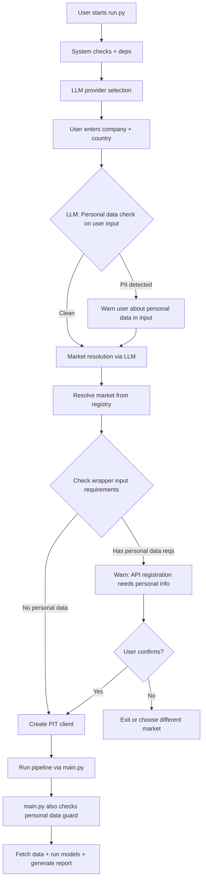

# Research-Driven Implementation Plan

**Date**: 2026-02-24
**Source of truth**: `.roo/research/` logs + `plans/` analysis documents
**Note**: The two PDF specs are outdated and not followed strictly.

---

## Overview

This plan covers three major areas:
1. **Bug fixes** identified in research and codebase reviews
2. **New features and wrapper updates** from `.roo/research/` findings
3. **LLM personal data detection** -- make the LLM analyze user input and wrapper input requirements to detect personal information, warning the user in both `run.py` and `main.py`

---

## Phase 1: Critical Bug Fixes (P0)

### 1.1 Fix `load_config` double `.yml` extension
**Source**: `plans/full-codebase-review-bug-report-and-findings.md` BUG 1-2
**Files**: `main.py`, `operator1/analysis/economic_planes.py`

- `main.py`: Change `load_config("global_config.yml")` to `load_config("global_config")`
- `economic_planes.py`: Change `load_config("economic_planes.yml")` to `load_config("economic_planes")`
- This fixes the entire 5-plane economic classification system and estimation config loading

### 1.2 Fix canonical translator field name alignment
**Source**: `plans/bug-fix-plan-canonical-naming-and-financial-logic.md` Fix 1
**Files**: `operator1/clients/canonical_translator.py`, `operator1/clients/esef.py`, `operator1/clients/edinet.py`, `operator1/clients/companies_house.py`

- Rename `stockholders_equity` to `total_equity` in CANONICAL_BALANCE
- Rename cashflow fields: `operating_cashflow` to `operating_cash_flow`, `investing_cashflow` to `investing_cf`, `financing_cashflow` to `financing_cf`, `capital_expenditure` to `capex`, `free_cashflow` to `free_cash_flow`
- Rename `income_tax` to `taxes`, `accounts_receivable` to `receivables`, `accounts_payable` to `payables`
- Update all 8 concept maps

### 1.3 Fix Altman Z-Score x2 variable
**Source**: `plans/bug-fix-plan-canonical-naming-and-financial-logic.md` Fix 3
**File**: `operator1/models/financial_health.py`

- Use `retained_earnings` instead of `total_equity` for x2

### 1.4 Add EBITDA computation
**Source**: `plans/bug-fix-plan-canonical-naming-and-financial-logic.md` Fix 4
**File**: `operator1/features/derived_variables.py`

- Add EBITDA derivation in `_compute_profitability()`

### 1.5 Add reconciliation alias
**Source**: `plans/bug-fix-plan-canonical-naming-and-financial-logic.md` Fix 2
**File**: `operator1/quality/data_reconciliation.py`

- Add `stockholders_equity` to `total_equity` alias

### 1.6 Fix NaN checks readability
**Source**: `plans/full-codebase-review-bug-report-and-findings.md` BUG 10
**File**: `main.py`

- Replace `x != x` idiom with `pd.isna(x)`

---

## Phase 2: LLM Personal Data Detection in User Input and Wrapper Requirements

This is the core new feature: make the LLM check user input against each wrapper's input requirements and detect if any personal information is being requested or provided.

### 2.1 Create personal data detection utility
**File**: `operator1/clients/personal_data_guard.py` (new)

```
Purpose: Use the configured LLM to analyze:
  1. The user's input (company name, country, API keys)
  2. The target wrapper's input requirements (what the API needs)
  
If ANY input appears to contain or request personal information
(names, addresses, personal IDs, phone numbers, emails, etc.),
warn the user before proceeding.
```

**Implementation**:
- `check_personal_data(user_input, wrapper_requirements, llm_client)` function
- Builds a prompt asking the LLM to classify whether:
  - The user input contains personal identifiable information (PII)
  - The wrapper's API registration process requires personal data
  - The data being fetched could expose personal information
- Returns a `PersonalDataCheckResult` with:
  - `has_personal_data: bool`
  - `warnings: list[str]`
  - `details: str`

**Wrapper input requirement map** (from research):

| Market | API Key Registration Requires | Personal Data Risk |
|--------|-------------------------------|-------------------|
| SEC EDGAR | Email only (User-Agent) | LOW |
| Companies House | Account registration | LOW |
| EDINET | Name, phone, affiliation | MEDIUM -- phone may need Japanese number |
| DART | Email, name, usage purpose, IP | MEDIUM |
| MOPS | None | NONE |
| CVM | None | NONE |
| CMF | None | NONE |
| ESEF | None | NONE |
| Alpha Vantage | Email | LOW |
| FRED | Email | LOW |

### 2.2 Integrate into `run.py`
**File**: `run.py`

- After LLM setup (Step 3) and before company input (Step 6):
  - When user enters company + country, pass to LLM for personal data check
- After market resolution (Step 7):
  - Check the resolved market's API requirements
  - If the market requires API key registration that involves personal data, warn the user
  - Show: "This market's API registration requires: [details]. This includes personal information."
  - Ask user to confirm they understand

### 2.3 Integrate into `main.py`
**File**: `main.py`

- After market selection and before PIT client creation:
  - Run personal data guard check
  - Log warnings about personal data requirements
  - In interactive mode, prompt for confirmation
  - In non-interactive mode (CLI args), log the warning

### 2.4 Build wrapper input requirement registry
**File**: `operator1/clients/pit_registry.py`

- Add `input_requirements` field to `MarketInfo` dataclass:
  ```python
  input_requirements: str = ""  # Human-readable description of what the API needs
  personal_data_level: str = "none"  # none, low, medium, high
  registration_url: str = ""
  ```
- Populate for all markets based on `.roo/research/` findings

---

## Phase 3: Wrapper Updates from Research Findings

### 3.1 EDINET wrapper API alignment
**Source**: `.roo/research/jp-edinet-2026-02-24.md` Section A7
**File**: `operator1/clients/jp_edinet_wrapper.py`

- Fix: `search_companies(name)` to `edinet_tools.search(name, limit=20)`
- Fix: `get_supported_companies()` to gov API filing scan
- Fix: `get_company_info(id)` to `edinet_tools.entity(id)`
- Fix: `resolve_company(id)` to `edinet_tools.entity(id)`
- Fix: `api.get_documents(date)` to `edinet_tools.documents(date)`

### 3.2 SEC EDGAR edgartools v5.15+ compatibility
**Source**: `.roo/research/us-sec-edgar-2026-02-24.md` Section A6-A7
**File**: `operator1/clients/us_edgar.py`

- Add compat shim: try `cashflow_statement()` first, fall back to `cash_flow()`
- Handle `CompanyNotFoundError` from v5.16+
- Verify `requirements.txt` has `edgartools>=5.15`

### 3.3 Remove pyesef dependency (archived)
**Source**: `.roo/research/eu-esef-2026-02-24.md` Section A2
**File**: `requirements.txt`, `operator1/clients/eu_esef_wrapper.py`

- Remove `pyesef>=1.0` from `requirements.txt` (library archived 2026-01-03)
- Wrapper already degrades gracefully -- just clean up the dead dependency

### 3.4 CVM wrapper: remove unused pycvm import
**Source**: `.roo/research/br-cvm-2026-02-24.md` Section A5
**File**: `operator1/clients/br_cvm_wrapper.py`

- pycvm is imported but never actually used (file-based API, not web)
- Either properly use pycvm's DFPITRFile API or remove the import

### 3.5 MOPS POST bypass fix
**Source**: `plans/full-codebase-review-bug-report-and-findings.md` BUG 3
**File**: `operator1/clients/mops.py`

- Add rate limiting to `_post()` method
- Add caching for MOPS POST responses

### 3.6 Shared rate limit for Alpha Vantage
**Source**: `.roo/research/ohlcv-alpha-vantage-2026-02-24.md` Section B4
**Files**: `operator1/clients/ohlcv_provider.py`, `operator1/features/news_sentiment.py`

- Verify shared daily counter between OHLCV and NEWS_SENTIMENT endpoints
- Both share 25 requests/day limit

---

## Phase 4: Infrastructure Improvements

### 4.1 Duplicate `create_pit_client` cleanup
**Source**: `plans/full-codebase-review-bug-report-and-findings.md` BUG 8
**File**: `main.py`

- Remove duplicate `_create_pit_client()` from `main.py`
- Import from `operator1.clients.equity_provider` instead

### 4.2 Add `cached_post()` to http_utils
**Source**: `plans/full-codebase-review-bug-report-and-findings.md` Architecture recommendation
**File**: `operator1/http_utils.py`

- Add `cached_post()` function with same rate-limiting and caching as `cached_get()`
- Update MOPS, CVM, Companies House, supplement.py, and gemini.py to use it

### 4.3 Module-level cache TTL
**Source**: `plans/full-codebase-review-bug-report-and-findings.md` BUG 9
**Files**: `operator1/clients/sec_edgar.py`, `operator1/clients/esef.py`

- Add TTL-based invalidation to module-level caches
- Default TTL: 1 hour for company lists

---

## Phase 5: Tier 2 Market Wrapper Stubs (from research)

Based on `.roo/research/unofficial-wrapper-discovery-2026-02-24.md`, enhance stubs:

### 5.1 China (cn_sse.py) -- akshare integration
- akshare v1.18.27 is comprehensive for SSE/SZSE
- Add as optional dependency for China market

### 5.2 Australia (au_asx.py) -- asx package
- asx v1.5.2 provides stock data
- Add as optional dependency

### 5.3 India (in_bse.py) -- jugaad-data
- jugaad-data v0.29 provides NSE/BSE data
- Add as optional dependency

### 5.4 UK iXBRL parsing -- ixbrl-parse
- ixbrl-parse v0.10.1 can fill the UK Companies House financial data gap
- Add as optional dependency for parsing iXBRL documents

---

## Execution Flow Diagram



---

## Files Modified Summary

| File | Changes |
|------|---------|
| `main.py` | Fix load_config, fix NaN, remove dup create_pit_client, add personal data guard |
| `run.py` | Add personal data detection flow with LLM integration |
| `operator1/clients/personal_data_guard.py` | NEW -- LLM-based PII detection |
| `operator1/clients/pit_registry.py` | Add input_requirements + personal_data_level fields |
| `operator1/clients/canonical_translator.py` | Fix field name alignment |
| `operator1/clients/jp_edinet_wrapper.py` | Fix edinet-tools v0.3 API calls |
| `operator1/clients/us_edgar.py` | Add edgartools v5.15+ compat |
| `operator1/clients/eu_esef_wrapper.py` | Clean up pyesef references |
| `operator1/clients/br_cvm_wrapper.py` | Remove unused pycvm import |
| `operator1/clients/mops.py` | Add rate limiting to POST |
| `operator1/clients/esef.py` | Update concept map targets |
| `operator1/clients/edinet.py` | Update concept map targets |
| `operator1/clients/companies_house.py` | Update concept map targets |
| `operator1/analysis/economic_planes.py` | Fix load_config call |
| `operator1/models/financial_health.py` | Fix Altman Z-Score x2 |
| `operator1/features/derived_variables.py` | Add EBITDA computation |
| `operator1/quality/data_reconciliation.py` | Add alias mapping |
| `operator1/http_utils.py` | Add cached_post function |
| `requirements.txt` | Remove pyesef, verify edgartools/edinet-tools pins |
| `tests/test_personal_data_guard.py` | NEW -- tests for PII detection |
