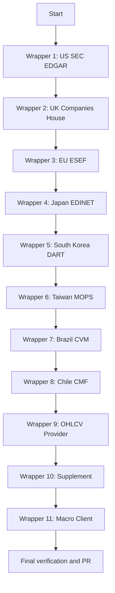

# Research-Driven Wrapper Audit Plan

## Overview

Audit all 11 data-source wrapper clients in the Operator 1 codebase to verify they fetch **exactly the data the app needs** -- not just any data. Each wrapper will be researched against current official API documentation (Feb 2026), verified for correct library versions, and validated against the `PITClient` protocol and `canonical_fields.yml`.

This is a **Python project** (not Node.js), so PyPI replaces npm for version checks.

---

## Wrapper Inventory

| # | Wrapper File | Region | API/SDK | Library in requirements.txt |
|---|-------------|--------|---------|----------------------------|
| 1 | `operator1/clients/us_edgar.py` | US | SEC EDGAR | `edgartools>=4.0`, `sec-edgar-api>=1.0` |
| 2 | `operator1/clients/uk_ch_wrapper.py` | UK | Companies House REST | direct HTTP -- no library |
| 3 | `operator1/clients/eu_esef_wrapper.py` | EU | filings.xbrl.org | `pyesef>=1.0` |
| 4 | `operator1/clients/jp_edinet_wrapper.py` | Japan | EDINET API v2 | `edinet-tools>=0.1` |
| 5 | `operator1/clients/kr_dart_wrapper.py` | South Korea | DART Open API | `dart-fss>=0.4` |
| 6 | `operator1/clients/tw_mops_wrapper.py` | Taiwan | MOPS form POST | no library -- scraper |
| 7 | `operator1/clients/br_cvm_wrapper.py` | Brazil | CVM API | `pycvm>=0.4` |
| 8 | `operator1/clients/cl_cmf_wrapper.py` | Chile | CMF API | direct HTTP -- no library |
| 9 | `operator1/clients/ohlcv_provider.py` | Global | Alpha Vantage | direct HTTP -- no library |
| 10 | `operator1/clients/supplement.py` | Global | OpenFIGI + regional | direct HTTP -- no library |
| 11 | `operator1/clients/macro_client.py` | Global | FRED, ECB, ONS, etc. | `fredapi>=0.5`, `wbgapi>=1.0`, `sdmx1>=2.0` |

---

## What the App Expects from Each Wrapper

### PITClient Protocol -- required methods from `pit_base.py`

Every PIT wrapper MUST return:

1. **`list_companies(query)`** -- list of dicts with: `ticker`, `name`, `cik`
2. **`search_company(name)`** -- same format as list_companies
3. **`get_profile(identifier)`** -- dict with: `name`, `ticker`, `isin`, `country`, `sector`, `industry`, `exchange`, `currency`, `market_cap`
4. **`get_income_statement(identifier)`** -- DataFrame with `filing_date`, `report_date`, plus canonical income fields
5. **`get_balance_sheet(identifier)`** -- DataFrame with `filing_date`, `report_date`, plus canonical balance fields
6. **`get_cashflow_statement(identifier)`** -- DataFrame with `filing_date`, `report_date`, plus canonical cashflow fields
7. **`get_quotes(identifier)`** -- DataFrame with: `date`, `open`, `high`, `low`, `close`, `volume`
8. **`get_peers(identifier)`** -- list of ticker strings
9. **`get_executives(identifier)`** -- list of dicts

### Canonical Financial Fields -- from `canonical_fields.yml`

**Income statement fields**: `revenue`, `gross_profit`, `operating_income`, `ebit`, `ebitda`, `net_income`, `taxes`, `interest_expense`, `cost_of_revenue`, `research_and_development`, `sga_expense`

**Balance sheet fields**: `total_assets`, `total_liabilities`, `total_equity`, `current_assets`, `current_liabilities`, `cash_and_equivalents`, `short_term_debt`, `long_term_debt`, `retained_earnings`, `goodwill`, `intangible_assets`, `receivables`, `inventory`, `payables`

**Cash flow fields**: `operating_cash_flow`, `investing_cf`, `financing_cf`, `capex`, `free_cash_flow`, `dividends_paid`

**OHLCV fields**: `date`, `open`, `high`, `low`, `close`, `volume`, `adjusted_close`

---

## Research Protocol Per Wrapper

For **each** of the 11 wrappers, execute these steps sequentially in Code mode:

### Phase 1: Research

1. **PyPI Version Check**: Fetch `https://pypi.org/pypi/{package}/json` to get latest version, compare to `requirements.txt`
2. **Official Documentation**: Use web fetch to read current API docs
3. **Breaking Changes**: Search for changelogs, migration guides for 2025-2026
4. **GitHub Repo Check**: Review the library repo for recent issues, breaking commits
5. **Create Research Log**: Write `.roo/research/{wrapper-name}-2026-02-24.md` with findings

### Phase 2: Environment Sync

1. Check installed versions vs required versions
2. Update `requirements.txt` if needed
3. Install/upgrade packages

### Phase 3: Code Audit & Fix

For each wrapper, verify:

- API endpoints are current and not deprecated
- Authentication patterns match current docs
- Response parsing extracts the correct fields
- All canonical fields are mapped -- not just a subset
- `filing_date` and `report_date` are properly extracted
- Error handling matches official error codes
- Rate limiting respects current API limits

### Phase 4: Verification

- Add inline doc references to each API call
- Add verification checklist comment block
- Run existing tests to confirm no regressions

---

## Detailed Per-Wrapper Audit Tasks

### Wrapper 1: US SEC EDGAR -- `us_edgar.py`

**Libraries**: `edgartools` primary, `sec-edgar-api` fallback
**API**: `https://data.sec.gov` -- free, no key, User-Agent required

**Research targets**:
- PyPI: `edgartools`, `sec-edgar-api` latest versions
- Docs: SEC EDGAR API docs at sec.gov, edgartools GitHub README
- Existing doc: `SEC EDGAR Api doc` in repo root

**Audit focus**:
- Verify `edgar.Company()` API is still current in edgartools
- Check US-GAAP concept mappings in `_USGAAP_INCOME_CONCEPTS`, `_USGAAP_BALANCE_CONCEPTS`, `_USGAAP_CASHFLOW_CONCEPTS` are complete for all canonical fields
- Verify `filing_date` extraction uses SEC acceptance date
- Confirm `companyfacts` / `companyconcept` endpoints still work
- Check rate limiting compliance with SEC fair-use policy

### Wrapper 2: UK Companies House -- `uk_ch_wrapper.py`

**Libraries**: None -- direct HTTP via `http_utils.cached_get`
**API**: `https://api.company-information.service.gov.uk` -- free, key required

**Research targets**:
- Official docs: Companies House API reference
- Existing doc: `company's house Api doc` in repo root

**Audit focus**:
- Verify `/search/companies`, `/company/{id}`, `/company/{id}/filing-history` endpoints are current
- Check iXBRL document parsing -- currently only extracts filing metadata, NOT actual financial numbers from iXBRL
- This is a MAJOR gap: `_fetch_financials_from_filings` only gets filing dates/descriptions, returns no revenue/assets/etc.
- Authentication: Basic auth with API key -- verify format is still correct

### Wrapper 3: EU ESEF -- `eu_esef_wrapper.py`

**Libraries**: `pyesef` optional, filings.xbrl.org API as primary data source
**API**: `https://filings.xbrl.org/api` -- free, no key

**Research targets**:
- PyPI: `pyesef` latest version
- Docs: filings.xbrl.org API documentation
- IFRS concept mappings in canonical_translator

**Audit focus**:
- Verify filings.xbrl.org `/filings` endpoint response schema
- Check IFRS concept extraction from XBRL facts
- Verify `_IFRS_MAP` coverage for all canonical fields
- Confirm `filing_date` extraction from ESEF filing metadata

### Wrapper 4: Japan EDINET -- `jp_edinet_wrapper.py`

**Libraries**: `edinet-tools` primary, direct EDINET API v2 fallback
**API**: `https://api.edinet-fsa.go.jp/api/v2` -- free, key recommended

**Research targets**:
- PyPI: `edinet-tools` latest version and API
- Docs: EDINET API v2 official docs
- Existing doc: `EDINET Api doc` in repo root
- JPPFS concept mappings

**Audit focus**:
- Verify `edinet_tools.search_companies()` and `edinet_tools.get_supported_companies()` are valid API calls
- Check `/documents.json` endpoint params -- `date`, `type`, `Subscription-Key`
- Verify JPPFS concept mapping coverage in `_JPPFS_MAP`
- Confirm form codes for annual/quarterly reports

### Wrapper 5: South Korea DART -- `kr_dart_wrapper.py`

**Libraries**: `dart-fss` primary, direct DART API fallback
**API**: `https://opendart.fss.or.kr/api` -- free, key required

**Research targets**:
- PyPI: `dart-fss` latest version
- Docs: DART Open API docs, English portal
- Existing doc: `DART Api doc` in repo root

**Audit focus**:
- Verify `dart_fss.set_api_key()`, `dart_fss.get_corp_list()` API is current
- Check financial statement extraction via dart-fss
- Verify Korean GAAP / K-IFRS concept mappings
- Confirm `/list.json` fallback endpoint is still valid

### Wrapper 6: Taiwan MOPS -- `tw_mops_wrapper.py`

**Libraries**: None -- form POST scraper
**API**: `https://mops.twse.com.tw` -- free, no key, scraping-based

**Research targets**:
- MOPS website structure -- verify form endpoints still work
- TWSE company list endpoint
- Existing doc: `MOP Api doc` in repo root

**Audit focus**:
- Verify form POST endpoints: `t163sb04` (income), `t163sb05` (balance), `t163sb20` (cashflow) are still valid
- Check ROC date conversion is correct (ROC 115 = CE 2026)
- Verify TWSE company list endpoint `/exchangeReport/STOCK_DAY_ALL` response format
- Check `_TIFRS_MAP` coverage for Chinese field names
- Verify session headers and anti-scraping compliance

### Wrapper 7: Brazil CVM -- `br_cvm_wrapper.py`

**Libraries**: `pycvm` primary, direct CVM API fallback
**API**: `https://dados.cvm.gov.br/api/v1` -- free, no key

**Research targets**:
- PyPI: `pycvm` latest version and API
- Docs: CVM open data portal
- CVM dataset CSV structure

**Audit focus**:
- Verify `/cia_aberta` endpoint response schema
- Check CSV dataset URLs for DFP annual statements
- Verify `_CVM_ACCOUNT_MAP` coverage in canonical_translator
- Confirm pycvm API calls match current library version

### Wrapper 8: Chile CMF -- `cl_cmf_wrapper.py`

**Libraries**: None -- direct HTTP
**API**: `https://www.cmfchile.cl` -- free, no key

**Research targets**:
- CMF Chile API/portal documentation
- FECU standardized financial statement format

**Audit focus**:
- Verify `/portal/informacion/entidades/busqueda` endpoint exists and returns JSON
- Check `/portal/estadisticas/fecu` endpoint for financial data
- Verify `_CMF_MAP` coverage in canonical_translator
- Confirm response field names: `cuenta`, `concepto`, `valor`, `monto`

### Wrapper 9: OHLCV Provider -- `ohlcv_provider.py`

**Libraries**: None -- direct HTTP
**API**: Alpha Vantage `https://www.alphavantage.co/query` -- free tier, key required

**Research targets**:
- Alpha Vantage API docs -- current endpoints and rate limits
- Free tier limits (currently coded as 25/day)

**Audit focus**:
- Verify `TIME_SERIES_DAILY` endpoint response format
- Check ticker suffix mappings for all markets
- Confirm free tier rate limit is still 25 requests/day
- Verify OHLCV column parsing matches API response keys
- Check if Alpha Vantage has changed JSON key names

### Wrapper 10: Supplement -- `supplement.py`

**Libraries**: None -- direct HTTP
**APIs**: OpenFIGI v3, Euronext, JPX, TWSE, B3, Santiago

**Research targets**:
- OpenFIGI v3 API docs
- Each regional supplement API

**Audit focus**:
- Verify OpenFIGI v3 mapping endpoint is still at `/v3/mapping`
- Check rate limits -- currently noted as 25 req/min without key
- Verify response schema for FIGI records
- Check each regional supplement endpoint is still accessible

### Wrapper 11: Macro Client -- `macro_client.py`

**Libraries**: `fredapi`, `wbgapi`, `sdmx1`
**APIs**: FRED, ECB SDW, ONS, Bundesbank, INSEE, e-Stat, KOSIS, DGBAS, BCB, BCCh

**Research targets**:
- PyPI: `fredapi`, `wbgapi`, `sdmx1` latest versions
- Each macro API endpoint

**Audit focus**:
- Verify FRED series IDs are current
- Check ECB SDW SDMX endpoint format
- Verify each country API returns GDP, inflation, interest rates, unemployment, FX
- Confirm `sdmx1` replaces old `pandasdmx` correctly

---

## Execution Order

Process wrappers ONE AT A TIME, completing the full research protocol before moving to the next:

## For Each Wrapper -- Code Mode Checklist

1. Create `.roo/research/{name}-2026-02-24.md` with research findings
2. Check PyPI for latest version of any library used
3. Fetch and read official API documentation
4. Compare wrapper code against official docs -- flag mismatches
5. Verify all canonical fields are mapped and extractable
6. Fix any issues found -- wrong endpoints, missing fields, broken parsing
7. Update `requirements.txt` if version upgrades needed
8. Add verification comment blocks to wrapper code
9. Run tests to confirm no regressions

## Known Issues to Investigate

1. **UK Companies House**: `_fetch_financials_from_filings` appears to only extract filing metadata -- no actual financial numbers. This likely needs iXBRL parsing to get real data.
2. **Taiwan MOPS**: Scraper-based -- MOPS form endpoints and HTML table structure may have changed.
3. **Chile CMF**: CMF API endpoints are unverified -- may return HTML instead of JSON.
4. **Brazil CVM**: CSV dataset URLs use year-based paths that may change format.
5. **OHLCV Provider**: Alpha Vantage free tier may have changed from 25 to different limits.
6. **edinet-tools**: Very small library -- `>=0.1` version pin suggests early/unstable.

## Output Artifacts

- `.roo/research/` directory with 11 research log files
- Updated wrapper code with verified API patterns
- Updated `requirements.txt` with pinned versions
- Feature branch with all changes
- Pull request for review
