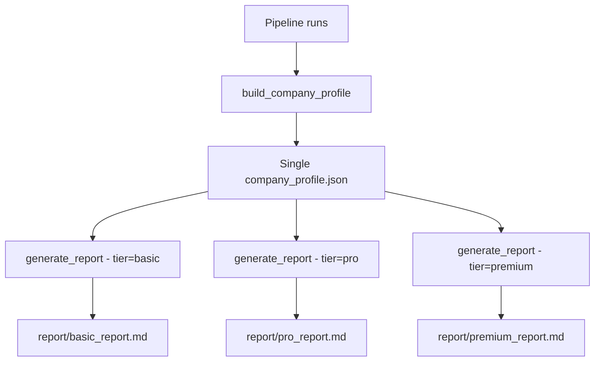

# Three-Tier Report System + Legacy API Cleanup

## Part 1: Three-Tier Report System

### Current State

The pipeline generates a single 22-section report (`analysis_report.md`) via:
- `report_generator.py` -- `generate_report()` produces one Markdown file
- `profile_builder.py` -- `build_company_profile()` assembles all data into one JSON
- Reports are generated either via Gemini AI or a local fallback template

### Design: Three Report Tiers

All three reports are generated together automatically -- no user choice needed.
The profile JSON stays the same; only the report generator produces three outputs.

#### Basic Report -- Limited Info
Sections included: 5 sections
1. Executive Summary
2. Company Overview -- name, ticker, sector, country, exchange
3. Current Financial Snapshot -- latest key ratios only
4. Survival Mode Status -- company flag, country flag
5. Risk Factors and Limitations

Purpose: Quick screening. No peers, no models, no macro context.

#### Pro Report -- Peers Included
Sections included: 13 sections -- everything in Basic, plus:
6. Historical Performance Analysis -- price trends, returns, drawdown
7. Financial Health Scoring -- 5-tier composite score
8. Linked Variables and Market Context -- peers, supply chain
9. Peer Comparison and Relative Valuation
10. Macroeconomic Environment -- quadrant classification
11. Market Sentiment and News Flow
12. Ethical Filter Assessment
13. Regulatory and Government Protection

Purpose: Comprehensive fundamental analysis with peer context and macro backdrop.

#### Premium Report -- Full Analysis -- the current report
Sections included: All 22 sections -- everything in Pro, plus:
14. Temporal Analysis and Model Insights -- regimes, breaks
15. Predictions and Forecasts -- multi-horizon
16. Technical Patterns and Chart Analysis
17. Supply Chain and Contagion Risk -- graph risk
18. Competitive Landscape -- game theory
19. Model Calibration and Adaptive Learning -- PID
20. Advanced Quantitative Insights -- SHAP, Sobol, copula, etc.
21. Investment Recommendation
22. Appendix and Methodology

Purpose: Institutional-grade deep-dive with all 25+ models.

### Implementation Approach

**Key principle**: Do NOT duplicate the profile builder. The same `company_profile.json` feeds all three tiers. The report generator gets a new `tier` parameter that controls which sections to include.

#### Changes to `report_generator.py`

1. Add a `ReportTier` enum: `BASIC`, `PRO`, `PREMIUM`
2. Define `TIER_SECTIONS` mapping each tier to its included section numbers
3. Modify `_build_fallback_report()` to accept a tier parameter and only render included sections
4. Modify Gemini prompts to include tier-specific instructions -- tell it which sections to write
5. Modify `generate_report()` to accept `tier` param -- defaults to generating all three
6. Output files: `basic_report.md`, `pro_report.md`, `premium_report.md`

#### Changes to `main.py`

1. In Step 8, call `generate_report()` three times -- once per tier
2. Or add a `generate_all_reports()` convenience function that does all three

#### Changes to `report/profile_builder.py`

None. The profile stays comprehensive.

---

## Part 2: Legacy API Cleanup

Remove all references to Eulerpool, EOD, FMP, and World Bank APIs. These are dead code from the pre-PIT architecture.

### Files to Modify

#### Python Files -- Variable/Parameter Renames

| File | What to change |
|------|---------------|
| `operator1/steps/data_extraction.py` | Rename `eulerpool_client` param to `pit_client`, rename `fmp_ohlcv` field to `ohlcv`, remove `fmp_client` param |
| `operator1/steps/verify_identifiers.py` | Rename `eulerpool_client` to `pit_client`, remove `fmp_client` param |
| `operator1/steps/entity_discovery.py` | Rename `eulerpool_client` to `pit_client` throughout |
| `operator1/steps/cache_builder.py` | Update comments referencing FMP/Eulerpool, rename `use_fmp_prices` to `use_ohlcv_prices` |
| `operator1/clients/equity_provider.py` | Update docstring removing Eulerpool/EOD/FMP references |
| `operator1/features/news_sentiment.py` | Remove `fmp_client` parameter, update docstring |
| `operator1/features/macro_alignment.py` | Update docstring: World Bank -> per-region macro APIs |
| `operator1/features/macro_quadrant.py` | Update docstring: World Bank -> per-region macro APIs |
| `operator1/analysis/survival_mode.py` | Update comments: World Bank -> macro APIs |
| `operator1/analysis/fuzzy_protection.py` | Update docstring: World Bank -> macro APIs |
| `operator1/clients/gemini.py` | Update prompts: remove Eulerpool/FMP/World Bank references, update to PIT sources |
| `operator1/secrets_loader.py` | Already clean -- no changes needed |
| `main.py` | Remove `using_fmp_full` meta key, update `eulerpool_client` references in Step 5e |
| `tests/test_phase1_smoke.py` | Remove/update `test_load_from_env`, `test_load_eod_from_env`, `test_missing_equity_key_raises` |
| `tests/test_phase3_features.py` | Rename `fmp_ohlcv` references to `ohlcv` |

#### Config Files

| File | What to change |
|------|---------------|
| `config/canonical_fields.yml` | Replace `source: eulerpool_*` with `source: pit_profile`, `source: pit_income_statement`, etc. Replace `source: world_bank` with `source: macro_api` |
| `config/world_bank_indicator_map.yml` | Delete this file entirely -- the indicator mapping now lives in `pit_registry.py` MACRO_APIS |
| `config/country_survival_rules.yml` | Update World Bank comments to reference macro APIs |

#### Dataclass Field Renames

The `EntityData.fmp_ohlcv` field in `data_extraction.py` should be renamed to `ohlcv`. This propagates to:
- `cache_builder.py` -- `use_fmp_prices` -> `use_ohlcv_prices`, `entity.fmp_ohlcv` -> `entity.ohlcv`
- `data_extraction.py` -- `result.target.fmp_ohlcv` -> `result.target.ohlcv`
- `tests/test_phase3_features.py` -- `entity.fmp_ohlcv` -> `entity.ohlcv`

### Cleanup Order

1. Rename `fmp_ohlcv` -> `ohlcv` in EntityData and all references
2. Rename `eulerpool_client` -> `pit_client` in all function signatures
3. Remove dead `fmp_client` / `wb_client` parameters
4. Update all docstrings and comments
5. Update config YAML files
6. Delete `config/world_bank_indicator_map.yml`
7. Update Gemini prompt templates
8. Fix tests
9. Run full test suite

---

## Implementation Order

1. **Legacy cleanup first** -- rename params, remove dead refs, update configs
2. **Three-tier reports second** -- add tier enum, modify generator, wire in main.py
3. **Test everything** -- run full suite, verify all three reports generate

This ordering avoids merge conflicts: cleanup is straightforward renames, then the tier system builds on a clean codebase.
