# Unmerged Branch Integration Plan

## Current State

Our PR ([#1](https://github.com/Abdu4020/erutufroF2/pull/1)) on branch
`feat/eod-provider-vae-imputer-financial-health` adds EOD provider, VAE
imputer, and Z-Score/M-Score/Runway. It needs to be merged, and then
several pipeline gaps need to be addressed.

### Unmerged Branches

| Branch | Content | Action |
|--------|---------|--------|
| `feat/eod-provider-vae-imputer-financial-health` | EOD provider + VAE imputer + Z-Score/M-Score/Runway | **Merge** (our PR) |
| `feature/integration-gap-analysis` | 498-line gap analysis doc | **Merge** (reference doc, gaps already addressed by Phases A-E) |
| `feature/phase-d-e-plan` | 876-line implementation plan doc | **Merge** (reference doc, already implemented) |
| `feature/eod-alternative-provider` | EOD-only subset | **Delete** (superseded by our PR) |
| `feature/eod-provider-and-vae-imputer` | Source PR from upstream | **Delete** (superseded by our PR) |
| `feature/operator1-spec-doc` | Trivial: deleted README, added .env | **Delete** (not useful) |

---

## Critical Pipeline Gap: Estimation Not Wired

The `run_estimation()` function from `operator1/estimation/estimator.py`
(Phase 5 Sudoku inference, including the new VAE imputer backend) is
**never called** in `main.py`. The pipeline jumps from cache building
(Step 4) directly to feature engineering (Step 5) without running
estimation to fill missing values.

This means:
- The two-pass estimation engine (identity fill + BayesianRidge/VAE) never runs
- The VAE imputer we just integrated has no entry point
- Missing financial data stays missing instead of being intelligently imputed
- The `estimation_coverage.json` referenced by the profile builder is never created

### Fix Required

Add a new Step 4b in `main.py` between cache building and feature
engineering:

```
Step 4: Build cache
Step 4b: Run estimation (Sudoku inference)  <-- NEW
Step 5: Feature engineering
```

This step should:
1. Call `run_estimation()` on the cache DataFrame
2. Read `estimation_imputer` from `global_config.yml` to decide VAE vs BayesianRidge
3. Save `estimation_coverage.json` for the profile builder
4. Replace the cache with the estimated version

---

## Disconnected Modules Audit

Several Phase C/F/G modules are implemented but not called in the pipeline.
The temporal modeling step (Step 6) calls regime detection, forecasting,
forward pass, burn-out, Monte Carlo, and prediction aggregation -- but
misses these:

| Module | File | Called in main.py? | Action |
|--------|------|--------------------|--------|
| Candlestick patterns | `pattern_detector.py` | No | Wire into Step 6 after forecasting |
| Cycle decomposition | `cycle_decomposition.py` | No | Wire into Step 6 as feature extraction |
| Copula tail dependency | `copula.py` | No | Wire into Monte Carlo step |
| Transfer entropy | `causality.py` | No | Wire into Step 6 after regime detection |
| Sobol sensitivity | `sensitivity.py` | No | Wire into Step 7 profile building |
| Conformal prediction | `conformal.py` | No | Wire into prediction aggregation |
| SHAP explainability | `explainability.py` | No | Wire into Step 7 profile building |
| DTW analogs | `dtw_analogs.py` | No | Wire into Step 6 or Step 7 |

---

## Pipeline Flow (Current vs Target)

```mermaid
flowchart TD
    S0[Step 0: Load Secrets] --> S1[Step 1: Verify Identifiers]
    S1 --> S2[Step 2: Fetch Macro Data]
    S2 --> S3[Step 3: Discover Linked Entities]
    S3 --> S3b[Step 3b: Graph Risk]
    S3b --> S4[Step 4: Extract Data + Build Cache]
    S4 --> S4b[Step 4b: Estimation - MISSING]
    S4b --> S5[Step 5: Feature Engineering]
    S5 --> S5b[Step 5b: Fuzzy Protection]
    S5b --> S5c[Step 5c: Game Theory]
    S5c --> S5d[Step 5d: Financial Health]
    S5d --> S5e[Step 5e: News Sentiment]
    S5e --> S5f[Step 5f: Peer Ranking]
    S5f --> S5g[Step 5g: Macro Quadrant]
    S5g --> S6[Step 6: Temporal Modeling]
    S6 --> S6a[Regime Detection + Transfer Entropy - MISSING]
    S6a --> S6b[Cycle Decomposition - MISSING]
    S6b --> S6c[Candlestick Patterns - MISSING]
    S6c --> S6d[Forecasting + Forward Pass + Burn-out]
    S6d --> S6e[Monte Carlo + Copula - MISSING]
    S6e --> S6f[Prediction Aggregation + Conformal - MISSING]
    S6f --> S6g[DTW Analogs - MISSING]
    S6g --> S6h[SHAP Explainability - MISSING]
    S6h --> S7[Step 7: Build Profile + Sobol - MISSING]
    S7 --> S8[Step 8: Generate Report]

    style S4b fill:#ff6b6b,color:#fff
    style S6a fill:#ffd93d,color:#000
    style S6b fill:#ffd93d,color:#000
    style S6c fill:#ffd93d,color:#000
    style S6e fill:#ffd93d,color:#000
    style S6f fill:#ffd93d,color:#000
    style S6g fill:#ffd93d,color:#000
    style S6h fill:#ffd93d,color:#000
    style S7 fill:#ffd93d,color:#000
```



Red = critical missing step. Yellow = modules built but not wired in.

---

## Execution Plan

### Phase 1: Merge PR and Clean Up Branches

- [x] Merge PR #1 (EOD + VAE + Z-Score/M-Score/Runway)
- [ ] Cherry-pick gap analysis doc from `feature/integration-gap-analysis` into main
- [ ] Cherry-pick phase-d-e-plan doc from `feature/phase-d-e-plan` into main
- [ ] Delete superseded branches: `feature/eod-alternative-provider`, `feature/eod-provider-and-vae-imputer`, `feature/operator1-spec-doc`

### Phase 2: Wire Estimation into Pipeline (Critical)

- [ ] Add Step 4b in `main.py` calling `run_estimation()` after cache building
- [ ] Read `estimation_imputer` setting from `global_config.yml`
- [ ] Pass `imputer_method` parameter to `run_estimation()`
- [ ] Save `estimation_coverage.json` to output directory
- [ ] Replace cache with estimated DataFrame for downstream steps
- [ ] Add try/except with graceful degradation if estimation fails

### Phase 3: Wire Disconnected Modules

Each module follows the same pattern: import, call in try/except, log
result, pass to profile builder.

- [ ] Wire `compute_transfer_entropy()` into Step 6 after regime detection
- [ ] Wire `detect_candlestick_patterns()` into Step 6 before/after forecasting
- [ ] Wire `compute_cycle_decomposition()` into Step 6 as additional features
- [ ] Wire copula tail dependency into Monte Carlo step
- [ ] Wire conformal prediction into prediction aggregation (replace Gaussian CIs)
- [ ] Wire SHAP explainability into Step 7 profile building
- [ ] Wire DTW historical analogs into Step 6 or Step 7
- [ ] Wire Sobol sensitivity analysis into Step 7 profile building

### Phase 4: Verify and Test

- [ ] Run full test suite
- [ ] Verify `main.py --help` works
- [ ] Verify pipeline runs with `--skip-models` flag
- [ ] Verify estimation step produces coverage output
- [ ] Verify new modules appear in the company profile JSON
- [ ] Verify report includes all new sections

### Phase 5: Profile Builder and Report Updates

- [ ] Ensure profile builder includes estimation coverage, transfer entropy, candlestick patterns, cycle info, copula results, conformal intervals, SHAP attributions, DTW analogs, Sobol rankings
- [ ] Ensure report generator has sections/fallbacks for all new data
- [ ] Verify Gemini prompt template includes all new modules
