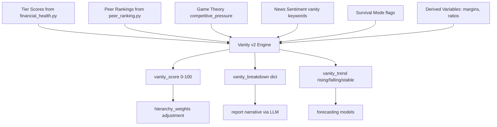

# Vanity Concept Upgrade Plan

## Current State

The vanity module (`operator1/analysis/vanity.py`) computes a single `vanity_percentage` from four static components:

| Component | Trigger | What it measures |
|---|---|---|
| Exec comp excess | comp > 5% of net income | Overpaid executives |
| SGA bloat | SGA ratio > 1.2x industry median | Administrative waste |
| Buyback waste | buybacks while FCF < 0 | Destroying value for optics |
| Marketing excess | marketing > 10% revenue during survival | Spending when drowning |

**Limitations:**
- Components rely on fields that are rarely available from PIT APIs (`exec_compensation`, `share_buybacks`, `marketing_expense`) -- so vanity is often entirely NaN
- No temporal awareness -- treats each day independently, misses trends
- No peer comparison -- doesn't benchmark waste against competitors
- Binary thinking -- "wasteful or not" with no severity gradient
- Disconnected from financial health scores and survival signals
- Report section is thin -- just latest/mean/peak numbers

## Upgrade Strategy

Use modules we already have to transform vanity from a "sometimes-computable flag" into a robust, always-available capital allocation quality score.



### Phase 1: Proxy-Based Components (always computable)

Replace hard-to-get raw fields with derived proxies from data we already have.

**Component 1 -- R&D vs Growth Mismatch (replaces exec comp excess)**
- Use `research_and_development_asof` (now in canonical_fields.yml) and `revenue_asof` growth
- If R&D spend is high but revenue growth is negative for 4+ quarters, flag as vanity R&D
- Uses: `derived_variables.py` revenue growth, `canonical_translator.py` R&D field

**Component 2 -- SGA Bloat v2 (enhanced with peer ranking)**
- Current logic compares to `industry_median_sga_ratio` but that field is almost never populated
- Upgrade: compute SGA-to-revenue ratio and rank it against `industry_peers` using `peer_ranking.py` percentile infrastructure
- If company is in the top 20th percentile for SGA ratio (most bloated) AND profitability is declining, flag as bloat
- Uses: `peer_ranking.py`, `linked_aggregates.py`, `sga_expense_asof` (now in canonical_fields.yml)

**Component 3 -- Capital Misallocation (replaces buyback waste)**
- Instead of requiring `share_buybacks` (rarely available), detect capital misallocation from what we have:
  - Debt increasing (`total_debt_asof` trend up) while `fh_liquidity_score` declining
  - `fh_solvency_score` below 30 while paying dividends (`dividends_paid_asof`, now in canonical_fields.yml)
  - `net_debt_to_ebitda` rising above 4x while no corresponding revenue growth
- Uses: `financial_health.py` tier scores, `derived_variables.py`, newly registered `dividends_paid_asof`

**Component 4 -- Competitive Decay (new, replaces marketing excess)**
- Use `game_theory.py` competitive pressure index
- If competitive pressure is high AND the company's `peer_ranking` composite is declining AND margins are compressing, this signals the company is losing ground -- a form of strategic vanity (maintaining the appearance of being competitive while actually falling behind)
- Uses: `game_theory.py`, `peer_ranking.py`, `financial_health.py`

**Component 5 -- Sentiment-Reality Gap (new)**
- Compare `news_sentiment.py` score against actual financial performance
- If news sentiment is positive (company is projecting success) but `fh_composite_score` is declining, the gap is vanity signaling
- Uses: `news_sentiment.py`, `financial_health.py`

### Phase 2: Temporal Vanity Score

**Rolling windows and trend detection:**
- Compute vanity score over 21-day and 63-day rolling windows
- Inject `vanity_trend` column: rising / falling / stable (using `regime_detector.py` change-point logic)
- Feed the trend into `hierarchy_weights.py` -- a rising vanity trend in survival mode should trigger stronger weight shifts than a static high value

**Columns produced:**
- `vanity_rnd_mismatch` (0-100 normalized)
- `vanity_sga_bloat_v2` (0-100 normalized)
- `vanity_capital_misallocation` (0-100 normalized)
- `vanity_competitive_decay` (0-100 normalized)
- `vanity_sentiment_gap` (0-100 normalized)
- `vanity_score` (weighted composite, 0-100)
- `vanity_score_21d` (rolling mean)
- `vanity_trend` (categorical: rising / stable / falling)
- `vanity_label` (Disciplined / Moderate / Wasteful / Reckless)
- Retain legacy `vanity_percentage` for backward compatibility

### Phase 3: Enhanced Report Integration

**profile_builder.py changes:**
- Expand `_build_vanity_section` to include all five sub-scores, the composite, the trend, and per-component explanations

**report_generator.py changes:**
- Expand the "Capital Allocation Efficiency" section with:
  - Breakdown bar showing which components contribute most
  - Peer comparison: "Company ranks in the Xth percentile for capital discipline among industry peers"
  - Trend narrative: "Capital allocation quality has been [improving/deteriorating] over the past N days"
  - When SHAP is available, add: "The primary driver of the vanity score is [X], contributing Y points"

**LLM prompt enhancement (llm_base.py):**
- Feed the vanity breakdown dict into the LLM context so it can generate richer narratives about management quality

### Phase 4: Config-Driven Thresholds

Add a `vanity_v2` section to `config/survival_hierarchy.yml`:

```yaml
vanity_v2:
  weights:
    rnd_mismatch: 0.15
    sga_bloat: 0.25
    capital_misallocation: 0.30
    competitive_decay: 0.15
    sentiment_gap: 0.15
  labels:
    - [20, Disciplined]
    - [40, Moderate]
    - [70, Wasteful]
    - [100, Reckless]
  trend_window_short: 21
  trend_window_long: 63
  hierarchy_adjustment:
    rising_trend_multiplier: 1.5
    threshold: 40
```

## Implementation Order

| Step | What | Files touched |
|---|---|---|
| 1 | Add proxy component functions to `vanity.py` | `operator1/analysis/vanity.py` |
| 2 | Wire peer ranking into SGA bloat v2 | `vanity.py`, `peer_ranking.py` |
| 3 | Wire financial health scores into capital misallocation | `vanity.py`, `financial_health.py` |
| 4 | Wire game theory + peer rank into competitive decay | `vanity.py`, `game_theory.py` |
| 5 | Wire news sentiment into sentiment-reality gap | `vanity.py`, `news_sentiment.py` |
| 6 | Add rolling windows and trend detection | `vanity.py` |
| 7 | Add vanity_v2 config section | `config/survival_hierarchy.yml` |
| 8 | Update hierarchy_weights for trend-aware adjustment | `operator1/analysis/hierarchy_weights.py` |
| 9 | Update profile_builder vanity section | `operator1/report/profile_builder.py` |
| 10 | Update report_generator vanity narrative | `operator1/report/report_generator.py` |
| 11 | Update LLM prompt to include vanity breakdown | `operator1/clients/llm_base.py` |
| 12 | Add canonical_fields.yml entries for new vanity columns | `config/canonical_fields.yml` |
| 13 | Write tests for each new component | `tests/test_vanity_v2.py` |
| 14 | Write integration test: vanity -> hierarchy -> report | `tests/test_vanity_v2.py` |

## Key Design Principles

1. **Always computable**: Every component uses fields we reliably have (derived variables, financial health scores, peer rankings) rather than rarely-available raw fields
2. **Backward compatible**: Legacy `vanity_percentage` stays, new score is `vanity_score`
3. **Config-driven**: All thresholds and weights in YAML, not hardcoded
4. **Testable**: Each of the 5 components is an independent pure function
5. **No new dependencies**: Everything uses existing modules (financial_health, peer_ranking, game_theory, news_sentiment, regime_detector)
