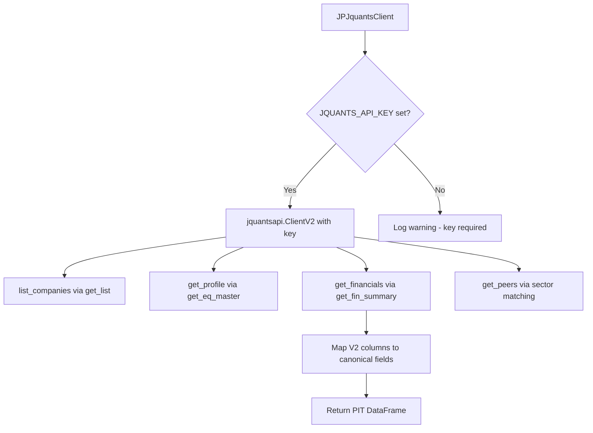
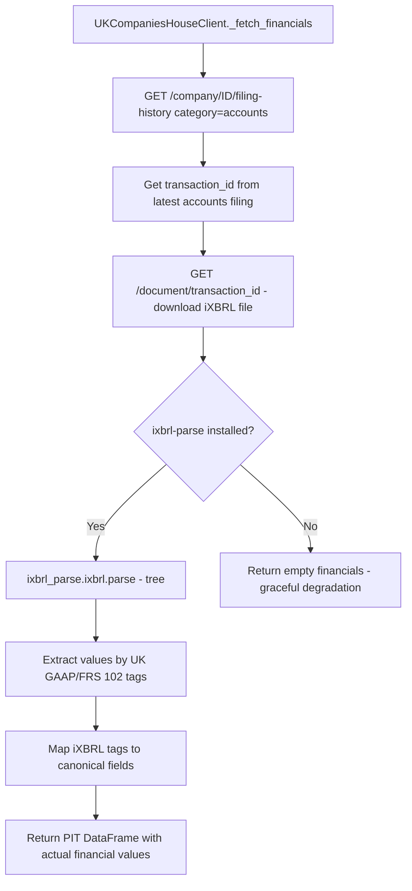
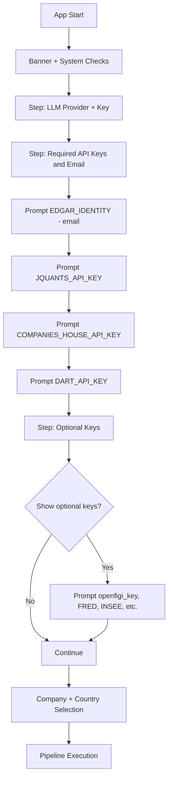

# Implementation Plan: Update Wrappers, Delete EDINET/CH Files, Add Key Input Prompts

## Overview

Based on the research in `.roo/research/jp-jquants-2026-02-25.md`, `.roo/research/uk-ixbrl-parse-2026-02-25.md`, and `.roo/research/api-key-requirements-summary-2026-02-25.md`, this plan covers three areas:

1. Replace EDINET wrapper with J-Quants wrapper
2. Replace Companies House financial gap with ixbrl-parse integration
3. Add startup key/email input prompts for all required credentials

---

## Part 1: Replace EDINET with J-Quants

### Files to Delete
- `operator1/clients/jp_edinet_wrapper.py` -- old EDINET wrapper (558 lines)

### Files to Create
- `operator1/clients/jp_jquants_wrapper.py` -- new J-Quants wrapper

### Files to Modify
- `requirements.txt` -- remove `edinet-tools>=0.3`, add `jquants-api-client>=2.0.0`
- `operator1/clients/equity_provider.py` -- change `jp_edinet` market to use `JPJquantsClient`
- `operator1/clients/pit_registry.py` -- update JP market entry (URL, description)
- `run.py` -- update `_COUNTRY_TO_MARKET` references from `jp_edinet` to `jp_jquants`
- `run.py` -- update `_KNOWN_COMPANIES` references
- `main.py` -- update docstring references to EDINET
- `.env.example` -- replace `EDINET_API_KEY` with `JQUANTS_API_KEY`
- `operator1/secrets_loader.py` -- add `JQUANTS_API_KEY` to optional keys

### New Wrapper Design: jp_jquants_wrapper.py



Key mapping from research log Section 6:
- `Sales` -> `revenue`
- `OP` -> `operating_income`
- `NP` -> `net_income`
- `TA` -> `total_assets`
- `Eq` -> `total_equity`
- `CFO/CFI/CFF` -> `operating_cashflow/investing_cashflow/financing_cashflow`

---

## Part 2: Replace Companies House Financial Gap with ixbrl-parse

### Files to Delete
- Nothing deleted -- `uk_ch_wrapper.py` is kept but modified

### Files to Modify
- `requirements.txt` -- uncomment/add `ixbrl-parse>=0.10.0`
- `operator1/clients/uk_ch_wrapper.py` -- add iXBRL document download + parse logic

### Integration Design



Tag mapping from research log Section 9:
- `uk-gaap:TurnoverRevenue` -> `revenue`
- `uk-gaap:ProfitLossForPeriod` -> `net_income`
- `uk-gaap:ShareholderFunds` -> `total_equity`
- etc.

---

## Part 3: Startup Key/Email Input Prompts

### Current State
- `run.py` already prompts for LLM keys (Gemini/Claude) at startup
- `run.py` has `setup_market_api_keys()` that prompts for CH and DART keys in "Enhanced" mode
- `secrets_loader.py` has `_OPTIONAL_KEYS` list but no interactive prompting

### Changes Needed

#### 3a. Update `secrets_loader.py` -- Add all keys to optional list
```python
_OPTIONAL_KEYS = [
    "GEMINI_API_KEY",           # LLM - Gemini
    "ANTHROPIC_API_KEY",        # LLM - Claude
    "COMPANIES_HOUSE_API_KEY",  # UK Companies House
    "JQUANTS_API_KEY",          # Japan J-Quants - NEW - replaces EDINET_API_KEY
    "DART_API_KEY",             # South Korea DART
    "EDGAR_IDENTITY",           # US SEC EDGAR - email identity - NEW
    "openfigi_key",             # OpenFIGI - optional higher rate limits - NEW
    "FRED_API_KEY",             # US FRED macro data - NEW
]
```

#### 3b. Update `run.py` -- setup_market_api_keys -- Prompt for ALL keys/emails

Replace the current `market_keys` list with:
```python
market_keys = [
    # -- Required for specific markets --
    ["JQUANTS_API_KEY", "Japan J-Quants", "https://jpx-jquants.com/login", True],
    ["COMPANIES_HOUSE_API_KEY", "UK Companies House", "https://developer.company-information.service.gov.uk/", True],
    ["DART_API_KEY", "South Korea DART", "https://opendart.fss.or.kr/", True],
    # -- Required identity, not a key --
    ["EDGAR_IDENTITY", "US SEC EDGAR email identity", "e.g. your.name@example.com", True],
    # -- Optional for higher rate limits --
    ["openfigi_key", "OpenFIGI - optional", "https://www.openfigi.com/api", False],
    # -- Macro data providers - optional --
    ["FRED_API_KEY", "US FRED macro data - optional", "https://fred.stlouisfed.org/docs/api/api_key.html", False],
    ["INSEE_API_KEY", "French INSEE - optional", "https://api.insee.fr/", False],
    ["ESTAT_API_KEY", "Japan e-Stat - optional", "https://api.e-stat.go.jp/", False],
    ["KOSIS_API_KEY", "Korea KOSIS - optional", "https://kosis.kr/openapi/", False],
    ["BCC_API_KEY", "Chile central bank - optional", "https://si3.bcentral.cl/", False],
]
```

#### 3c. Update `run.py` -- Always prompt for keys at startup

Currently keys are only prompted in "Enhanced" mode (choice 2). Change the flow:



For each key:
- If already in `.env` or environment, show it masked and skip
- If not set, prompt with registration URL
- Save to `.env` when entered
- For `EDGAR_IDENTITY`, validate it looks like an email

#### 3d. Update `.env.example` -- Complete key list

```dotenv
# LLM Providers - at least one required for AI reports
GEMINI_API_KEY=your_gemini_api_key_here
# ANTHROPIC_API_KEY=your_anthropic_api_key_here

# US SEC EDGAR - email identity required by SEC regulation
EDGAR_IDENTITY=your.name@example.com

# Japan J-Quants - free email registration at https://jpx-jquants.com/login
JQUANTS_API_KEY=your_jquants_api_key_here

# UK Companies House - free at https://developer.company-information.service.gov.uk/
# COMPANIES_HOUSE_API_KEY=your_companies_house_key_here

# South Korea DART - free at https://opendart.fss.or.kr/
# DART_API_KEY=your_dart_api_key_here

# Optional: OpenFIGI higher rate limits
# openfigi_key=your_openfigi_key_here

# Optional: Macro data providers - all free registration
# FRED_API_KEY=your_fred_key_here
# INSEE_API_KEY=your_insee_key_here
# ESTAT_API_KEY=your_estat_key_here
# KOSIS_API_KEY=your_kosis_key_here
# BCC_API_KEY=your_bcc_key_here
```

---

## Part 4: Cleanup References

### Files to Search and Update
All references to "EDINET" or "edinet" across the codebase:

| File | Change |
|------|--------|
| `main.py` line 9, 22, 43 | Update docstring: EDINET -> J-Quants |
| `main.py` references to `jp_edinet` | Change to `jp_jquants` |
| `run.py` line 393-394 | `jp_edinet` -> `jp_jquants` in `_COUNTRY_TO_MARKET` |
| `run.py` line 443-444 | `jp_edinet` -> `jp_jquants` in `_KNOWN_COMPANIES` |
| `operator1/clients/equity_provider.py` line 123-126 | Update JP market to use J-Quants |
| `operator1/clients/pit_registry.py` line 162-166 | Update JP market metadata |
| `operator1/secrets_loader.py` line 117 | Remove EDINET mention |
| `.env.example` line 43 | Remove EDINET reference |

### Old Research Files -- Keep for Historical Reference
- `.roo/research/jp-edinet-2026-02-24.md` -- keep, add "SUPERSEDED" header
- `.roo/research/uk-companies-house-2026-02-24.md` -- keep, add "SUPPLEMENTED" header

---

## Execution Order

1. Delete `operator1/clients/jp_edinet_wrapper.py`
2. Create `operator1/clients/jp_jquants_wrapper.py` using research log patterns
3. Update `requirements.txt` -- swap edinet-tools for jquants-api-client, enable ixbrl-parse
4. Update `operator1/clients/uk_ch_wrapper.py` -- add ixbrl-parse integration
5. Update `operator1/clients/equity_provider.py` -- JP market routing
6. Update `operator1/clients/pit_registry.py` -- JP market metadata
7. Update `operator1/secrets_loader.py` -- add new keys to optional list
8. Update `run.py` -- key prompts, market mappings, known companies
9. Update `main.py` -- docstrings and references
10. Update `.env.example` -- complete key list
11. Mark old research files as superseded
12. Commit, push, create PR
